# Autonomous Coding Beyond the Demo: Designing a Control Plane for Ten-Day Software Agents

*A systems analysis of Qwen3.8-Max, the public `oh-my-cli` trace, and the architecture required to turn long context into long-lived, auditable work*

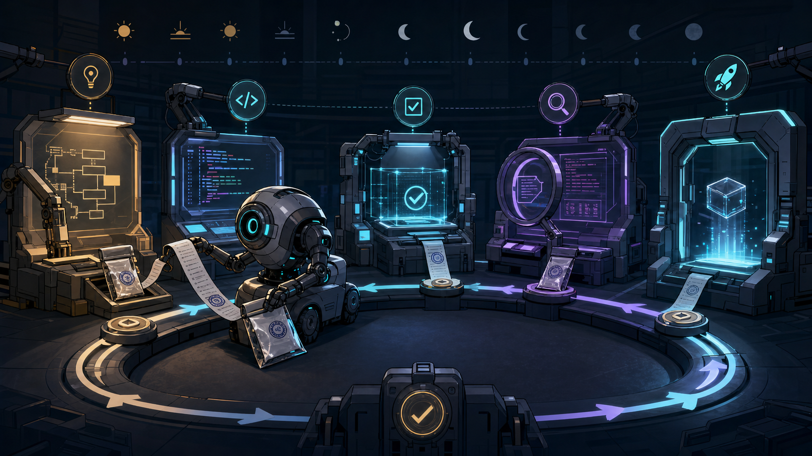

> **Evidence note — 4 August 2026.** Qwen describes Qwen3.8-Max as a 2.4-trillion-parameter mixture-of-experts model capable of 10+ day software projects, 500+ turns of chip-design optimization, year-long e-commerce strategy, and native visual feedback. Those are vendor-reported capabilities. This article independently audited the public [`oh-my-cli`](https://github.com/qwen-code-dev-bot/oh-my-cli) repository at commit [`97c9f5f`](https://github.com/qwen-code-dev-bot/oh-my-cli/tree/97c9f5f33b43c52c712634599b81e40262ac5603), rebuilt it in a clean Node 22 environment, and passed 3,043 tests plus 54 smoke tests. The audit does **not** establish the model's other claims, production SLOs, or general capability across professions.

## Executive summary

Ten-day autonomous coding is not a larger chat session. It is a distributed-systems problem in which the unreliable component happens to speak, plan, and write code.

The important unit is therefore not the prompt but the **closed-loop transaction**:

\[
\text{observe} \rightarrow \text{propose} \rightarrow \text{authorize} \rightarrow
\text{act} \rightarrow \text{measure} \rightarrow \text{commit or compensate}.
\]

A model can be brilliant at the second term and still fail catastrophically over ten days. Context drifts. Tests become correlated with the implementation. Tool output can contain hostile instructions. Retries amplify bad hypotheses. Two individually correct patches conflict. A GUI looks right while its network requests fail. The operating system kills the process. A token is broader than the task. The agent forgets why an invariant exists and “simplifies” it away.

The architecture that survives these conditions separates two planes:

- A **cognition plane** forms hypotheses, decomposes work, writes candidate patches, and chooses what evidence to request.
- A **control plane** owns durable state, leases, budgets, policy, sandboxing, independent verification, commit authority, recovery, and audit.

This division is analogous to Kubernetes reconciliation and database recovery. The model is neither the source of truth nor the transaction manager. It is a probabilistic controller operating against a durable desired-state ledger.

The public `oh-my-cli` project is valuable because its repository contains more than generated application code. It implements session recovery, deterministic compaction sidecars, isolated worktree leases, turn-scoped undo/redo, approval and policy hooks, multimodal input validation, and explicit governance. Its strongest result is architectural: continuity is built outside the model. Its weakest result is evaluation: repository tests and commit activity do not by themselves measure held-out autonomy, production reliability, or causal attribution to Qwen3.8-Max.

For infrastructure teams, five conclusions matter:

1. **Duration is an operational property, not a model property.** Long-running work requires replayable state, idempotency, recovery, and expiring authority.
2. **Every mutation should carry evidence.** Treat patches as transactions with preconditions, tests, provenance, and compensation paths.
3. **Memory needs anti-entropy.** Summaries are caches; the immutable event log remains authoritative.
4. **Vision should close a control loop.** Screenshots are observations with uncertainty, not decorative prompt attachments.
5. **Autonomy needs a reliability budget.** Spend verification, human review, and redundant execution where probability times impact is highest.

## Problem statement: a ten-day run is 500 chances to be wrong

Benchmarks historically compressed coding into a single issue and a terminal. [SWE-bench](https://arxiv.org/abs/2310.06770) made repository-level issue resolution measurable; [SWE-agent](https://arxiv.org/abs/2405.15793) showed that the agent-computer interface materially changes results; [OpenHands](https://arxiv.org/abs/2407.16741) generalized the sandbox and event-stream substrate. These were necessary advances, but a ten-day project changes the failure model.

Suppose a dependent chain has \(n\) irreversible-looking decisions, each with independent escape probability \(p\). The chance of completing the chain without an escaped error is

\[
P(\text{clean chain})=(1-p)^n.
\]

At an apparently excellent \(p=0.005\), 500 decisions yield \(0.995^{500}\approx 8.2\%\). Independence is optimistic: mistaken assumptions tend to correlate later decisions, so real failure can compound faster. The solution is not merely to raise model accuracy. It is to break one long chain into bounded, verified, compensatable segments.

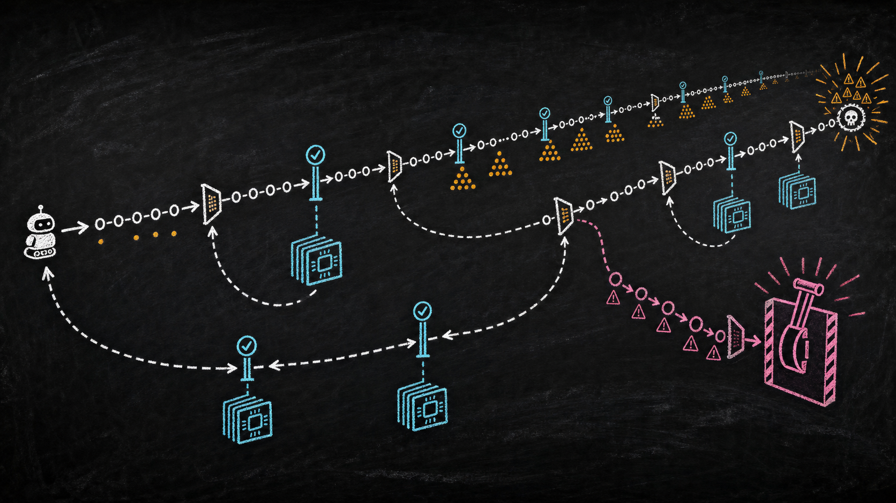

This also clarifies a frequently abused phrase: **time horizon**. METR defines its 50%-success time horizon as the time a human expert would need for tasks an agent completes half the time—not how long an agent process remains alive. Its [current measurement page](https://metr.org/time-horizons/) also warns that results are most reliable on tasks below roughly 16 hours and that the suite is concentrated in software, ML, and cybersecurity. “The loop ran for ten days” and “the system reliably completes ten-day human tasks” are different empirical claims.

The engineering target is therefore:

> Maintain goal fidelity and bounded authority across crashes, context replacement, adversarial inputs, environmental drift, and hundreds of partially dependent mutations—while producing enough evidence for another system or engineer to reproduce the result.

That target is closer to a workflow engine, a build farm, and a safety kernel than to an IDE autocomplete feature.

## Historical evolution: from completion to reconciliation

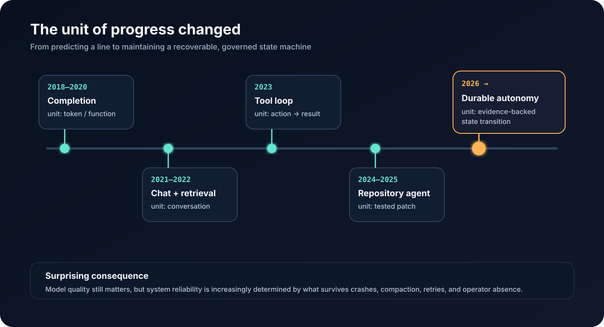

The path to long-horizon coding has four architectural eras.

**Completion (2018–2021).** Models predicted a function or next block from local context. The human held state, chose tools, tested, and integrated. Failure was cheap because authority was tiny.

**Conversational coding (2022–2023).** Larger context enabled multi-file discussion and iterative repair. The transcript became accidental state. Once it overflowed, the system either forgot or summarized itself without a durable provenance boundary.

**Repository agents (2023–2025).** Agents gained shells, editors, search, test runners, and isolated environments. SWE-bench made issue resolution a useful objective. [WebArena](https://arxiv.org/abs/2307.13854), [VisualWebArena](https://arxiv.org/abs/2401.13649), and [OSWorld](https://arxiv.org/abs/2404.07972) exposed a second frontier: action grounded in changing visual environments. The crucial discovery was that interface design, environment construction, and verification can matter as much as base-model capability.

**Durable autonomy (2025 onward).** The loop persists beyond a process, context window, or operator shift. It reconciles desired and observed state, leases resources, records events, evaluates risk, and resumes after interruption. Anthropic's distinction between fixed **workflows** and model-directed **agents** remains useful: use deterministic paths where the route is known, and spend agentic flexibility only where uncertainty justifies its latency and cost ([Building Effective Agents](https://www.anthropic.com/engineering/building-effective-agents)).

The surprising historical analogy is not “AI becomes a programmer.” It is “the shell script becomes a controller.” Kubernetes controllers continuously compare desired with actual state instead of assuming an action succeeded ([controller pattern](https://kubernetes.io/docs/concepts/architecture/controller/)). Temporal persists workflow history so computation can replay after failure ([workflow execution](https://docs.temporal.io/workflow-execution)). Long-horizon agents need both ideas, plus a security boundary around the proposer.

## What the `oh-my-cli` trace actually demonstrates

The audited repository began on 13 July 2026 and, at the inspected head on 4 August, contained 469 commits across 19 active calendar days. Of these, 456 used the bot service's two author identities. Commit volume peaked at 74 on 3 August. A clean build passed TypeScript checking, 3,043 tests in 173 files, and a 54-test smoke suite. The package identifies itself as version 0.1.0 and declares Node.js 22 or newer.

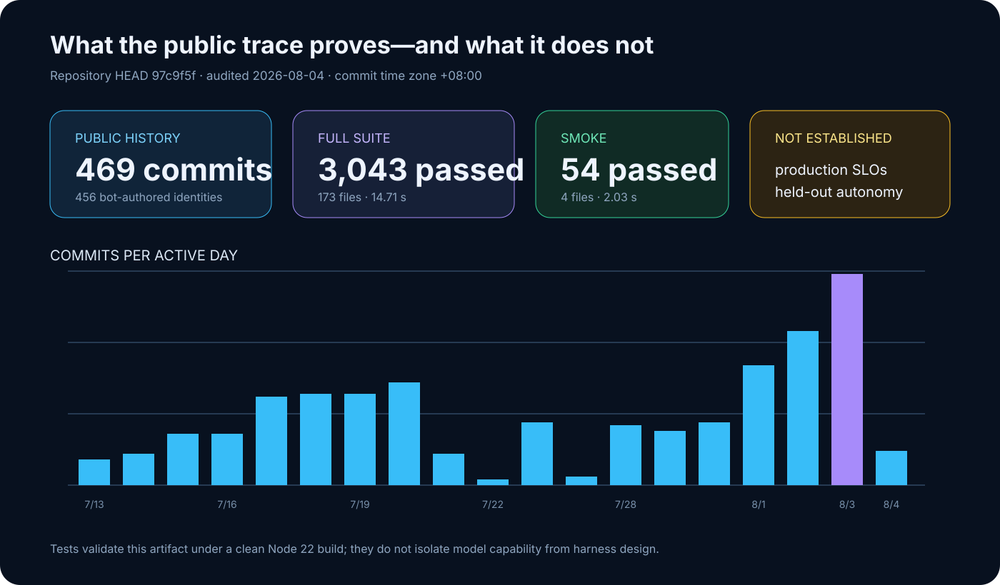

The repository's more consequential evidence is in its mechanisms:

| Mechanism | Observed implementation | Why it matters after day one |
|---|---|---|
| Governance plane | [`AUTONOMY.md`](https://github.com/qwen-code-dev-bot/oh-my-cli/blob/97c9f5f33b43c52c712634599b81e40262ac5603/AUTONOMY.md) limits executable work, leases, branches, protected files, checks, and escalation | Prevents the agent from silently redefining the rules under which its output is judged |
| Bounded inner loop | [`src/agent.ts`](https://github.com/qwen-code-dev-bot/oh-my-cli/blob/97c9f5f33b43c52c712634599b81e40262ac5603/src/agent.ts) caps rounds and checks turn, wall-time, token, and tool budgets | Infinite autonomy is composed from finite, inspectable transactions |
| Durable session | [`src/session.ts`](https://github.com/qwen-code-dev-bot/oh-my-cli/blob/97c9f5f33b43c52c712634599b81e40262ac5603/src/session.ts) uses JSONL and atomic temp-file promotion, preserving corrupt originals | A process crash does not have to become amnesia or silent transcript truncation |
| Anti-entropy memory | [`src/compaction.ts`](https://github.com/qwen-code-dev-bot/oh-my-cli/blob/97c9f5f33b43c52c712634599b81e40262ac5603/src/compaction.ts) stores bounded deterministic summaries beside the original transcript and validates source digests | The summary is a rebuildable index, not a new source of truth |
| Reversible mutation | [`src/turn-checkpoint.ts`](https://github.com/qwen-code-dev-bot/oh-my-cli/blob/97c9f5f33b43c52c712634599b81e40262ac5603/src/turn-checkpoint.ts) snapshots content, detects divergence, and limits undo/redo to turn-owned paths | Recovery avoids a broad `git reset` that could destroy unrelated human work |
| Work isolation | Worktree leases derive a stable identity from repository, task, and agent and refuse unsafe cleanup | Concurrency becomes explicit ownership rather than shared-directory optimism |
| Multimodal hygiene | [`src/image-input.ts`](https://github.com/qwen-code-dev-bot/oh-my-cli/blob/97c9f5f33b43c52c712634599b81e40262ac5603/src/image-input.ts) confines paths, sniffs magic bytes, caps dimensions and size, and retains raw bytes only in memory | “Vision input” is treated as untrusted binary data, not an innocent attachment |

The project's governance requires one active issue lease and one mutation branch, independent checks before completion, and quarantine after repeated identical failures. This is not proof that every commit was wise. It is evidence that the authors understood a central long-horizon principle: **a model's freedom should grow inside a shrinking operational envelope**.

Several caveats are non-negotiable:

- The model, harness, prompt, tests, and repository evolved together. Passing in-repository tests does not isolate model capability.
- The public history is selected evidence; it does not expose every failed trajectory, token, intervention, or external system state.
- A large test suite shows internal consistency under the tested environment, not production availability, security, or maintainability.
- The local install reported one moderate dependency vulnerability. Version 0.1.0 and the absence of a published operational SLO should temper “production-ready” language.
- The official launch claims about chip design, year-long strategy, and hundreds of professions were not independently reproducible from this repository.

This distinction is healthy. The trace is interesting precisely because it lets us examine a plausible control system without converting a case study into a benchmark.

## Core architecture: two planes and four ledgers

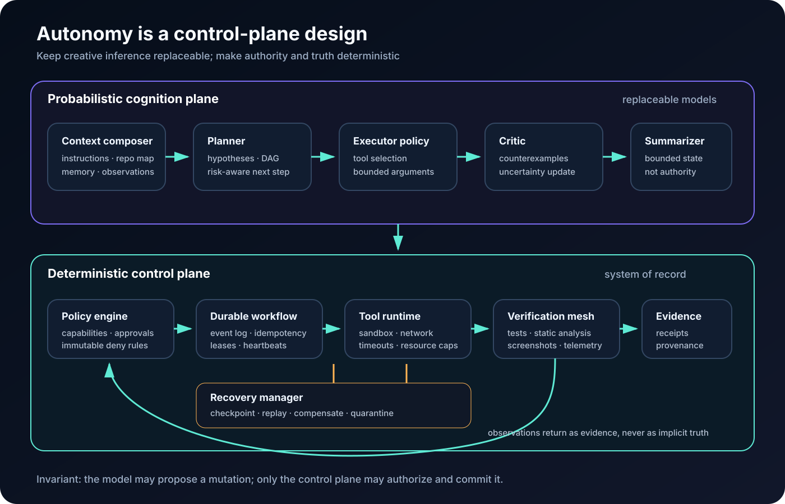

The architecture has one rule: **the model may propose a state transition; it may not define whether that transition is valid.**

The cognition plane includes planning, code generation, retrieval, visual interpretation, and hypothesis ranking. Its outputs are typed proposals. The control plane validates those proposals against four durable ledgers:

1. **Intent ledger** — desired outcomes, invariants, acceptance tests, provenance, and unresolved decisions.
2. **Event ledger** — append-only observations, tool calls, results, receipts, and state-transition identifiers.
3. **Capability ledger** — who or what may read, write, execute, access a secret, merge, or deploy; every grant expires.
4. **Evidence ledger** — which claims have which supporting artifacts, verifier version, environment fingerprint, and freshness.

Represent a proposed transition as

\[
\tau = (s_t, a, \pi, b, e, s_{t+1}),
\]

where \(s_t\) is observed state, \(a\) the proposed action, \(\pi\) the applicable policy, \(b\) the resource budget, and \(e\) the required evidence contract. The control plane commits \(s_{t+1}\) only if preconditions still hold and the evidence contract is satisfied. Otherwise it records an abort, compensation, or escalation. This is optimistic concurrency control for code-changing agents.

The four ledgers solve different failure classes. Combining them into one mutable “memory” document is tempting, but unsafe: a summarizer can accidentally rewrite intent; a tool can inject authority through its output; a passing test can be mistaken for evidence of a different claim.

## Component by component

### 1. The intent compiler

A vague request such as “take this from an empty folder to production” must become a typed goal graph, not a prose plan. Each node should declare:

```yaml
id: api.rate-limit
goal: bound unauthenticated request rate per source identity
preconditions: [threat-model.approved, redis.available]
invariants: [healthcheck.exempt, internal-mtls.not-ip-limited]
acceptance:
  - load_test.p99_ms < 120
  - bypass_suite == pass
risk: high
authority: [edit:gateway, execute:staging]
rollback: deploy.previous_digest
```

Compilation is valuable because prose hides contradictions. A graph exposes missing dependencies, parallelizable work, and high-risk cut vertices. The model can revise tactics, but changes to an invariant or acceptance criterion become governance events requiring a different authority path.

### 2. The planner as a receding-horizon controller

Planning the entire ten days once is brittle. Use model-predictive control: optimize a short action horizon, execute the first safe step, observe, and re-plan.

\[
a_t^* = \arg\min_{a_{t:t+H}} \mathbb{E}
\left[\sum_{k=t}^{t+H} L(s_k,a_k) + \lambda R(s_k,a_k)\right].
\]

Here \(L\) measures task loss—unfinished acceptance criteria, latency, defects, cost—and \(R\) measures operational risk. The horizon \(H\) should shrink when environmental uncertainty increases. Schema design can use a longer horizon than a flaky production incident; deployment should often be one guarded step.

An unconventional but useful addition is a **counterfactual shadow**. A second, read-only planner receives the same intent and current state but not the primary planner's reasoning. It proposes the most likely hidden assumption or destructive shortcut. Run it selectively when expected risk reduction exceeds its cost:

\[
P(\text{escape}) \cdot \text{impact} \cdot \text{detector recall}
> C_{\text{shadow}}.
\]

### 3. Memory as an anti-entropy system

Context windows are caches. Even Qwen's published 991K-token maximum input does not make them durable, current, or trustworthy. A robust memory stack has layers:

- immutable event history;
- content-addressed artifacts;
- derived summaries and indexes;
- a compact active working set;
- explicit confidence and freshness metadata.

Summaries should include the digest of the source prefix from which they were derived. If the prefix changes or validation fails, discard the summary and rebuild. This mirrors anti-entropy in replicated systems: derived views converge from authoritative history instead of overwriting it.

Facts should decay unless revalidated. One simple policy is

\[
c_i(t)=c_{i0}w_{\text{source}}e^{-\lambda_i(t-t_0)},
\]

where volatile facts—deployment state, dependency versions, active incidents—have high \(\lambda_i\), while an architectural invariant has low decay. Retrieval then optimizes not semantic similarity alone but relevance × confidence × freshness.

### 4. Tool runtime and capability broker

Tool schemas are security boundaries. Each invocation should carry an unforgeable execution identity, a scoped capability, timeout, resource ceiling, working directory, network policy, and expected side effects. A shell tool with “run anything” and ambient cloud credentials erases every higher-level safety promise.

Capabilities should be object-specific and short-lived: write these three paths, query this read replica, push this branch, deploy this digest to canary. Secret material is injected by a broker at execution time and never returned to model context. Outputs are tainted according to origin; web pages, issue bodies, test logs, images, and repository files remain data even when they contain imperative text.

### 5. Durable execution and reversible mutation

The event log is written before an external mutation, following the logic of a [write-ahead log](https://martinfowler.com/articles/patterns-of-distributed-systems/write-ahead-log.html). Each action has an idempotency key. On recovery, the runner asks whether the action committed, can be safely retried, or requires compensation.

Do not make “retry” the universal answer. Temporal's [retry guidance](https://docs.temporal.io/encyclopedia/retry-policies) distinguishes retryable activity failure from deterministic workflow logic. Agent systems need an additional taxonomy:

- **transient:** timeout, rate limit, worker loss → bounded exponential retry;
- **content:** compiler error, failed assertion → new hypothesis, not identical retry;
- **policy:** denied capability → escalation or plan change;
- **conflict:** state changed since observation → refresh and re-plan;
- **epistemic:** repeated contradictory evidence → circuit breaker and quarantine.

Turn-scoped snapshots are preferable to repository-wide reset. They restore only paths the transaction owns, verify that current content still matches the expected post-image, and preserve unrelated mutations.

### 6. The verifier mesh

A single test command is an oracle-shaped bottleneck. Verification should be a mesh of partly independent signals:

- deterministic unit, integration, property, and migration tests;
- type, lint, dependency, license, secret, and static security analysis;
- differential tests against the previous release or alternate implementation;
- chaos and fault-injection probes;
- browser/network/console inspection for user-visible paths;
- a model reviewer that cannot edit and does not see the generating rationale;
- canary telemetry checked against a predeclared SLO window.

Every task receives an **evidence contract**. “Login works” might require an HTTP trace, database side-effect, browser screenshot, accessibility tree, console-clean record, and rollback proof. The evidence ledger records artifact hashes and verifier versions; “passed yesterday” is not valid after the dependency lockfile changes.

The autonomy reliability budget can be expressed as

\[
B_R=\sum_i I_i \cdot P_i(\text{escape}\mid E_i),
\]

where \(I_i\) is consequence and \(E_i\) the available evidence. The controller spends additional verification until \(B_R\) falls below the task's threshold. This creates rational asymmetry: renaming a local variable needs little ceremony; changing an authorization boundary should trigger independent review, adversarial tests, and staged release.

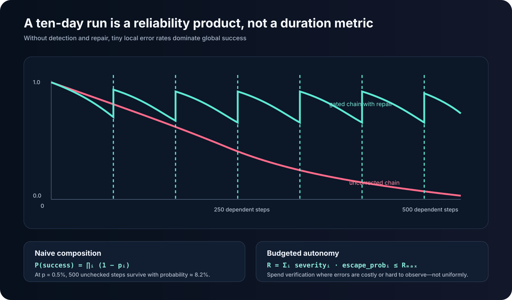

### 7. Native multimodal intelligence as residual control

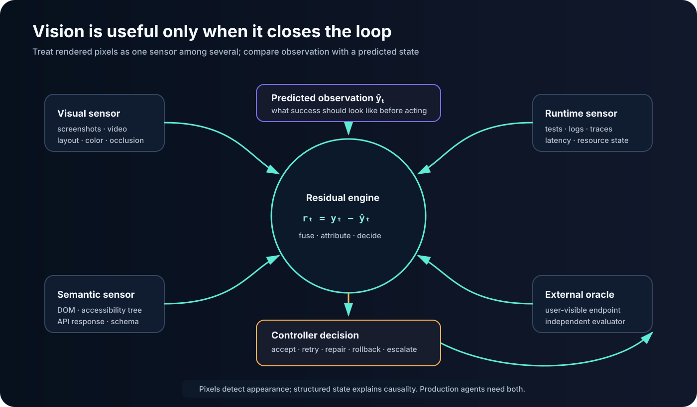

Vision becomes operationally interesting when it is continuous. At step \(t\), the planner predicts observable outcome \(\hat y_t\)—layout geometry, page state, chart values, console status, network responses. The runtime captures actual observation \(y_t\), normalizes it, and computes residual

\[
r_t = D(y_t,\hat y_t),
\]

where \(D\) combines pixel/structural similarity, OCR or accessibility-tree differences, and semantic checks. Large or safety-relevant residuals trigger re-observation, diagnosis, or rollback.

The important design is **sensor fusion**. A screenshot can show a green toast while the API returned a cached result; DOM inspection can miss canvas corruption; an accessibility tree can be correct while responsive layout clips the submit button. Use visual pixels, DOM/accessibility state, network events, console logs, and backend effects as independent channels.

Images are also an attack surface. Decode in a sandbox, verify magic bytes rather than extensions, cap dimensions and decompressed size, strip metadata, prevent workspace traversal, and store only content hashes plus derived observations in durable logs. OpenAI's description of browser feedback in [Codex upgrades](https://openai.com/index/introducing-upgrades-to-codex/) similarly emphasizes seeing and validating rendered work; the systems lesson is that observation must still cross a policy boundary.

## End-to-end data flow

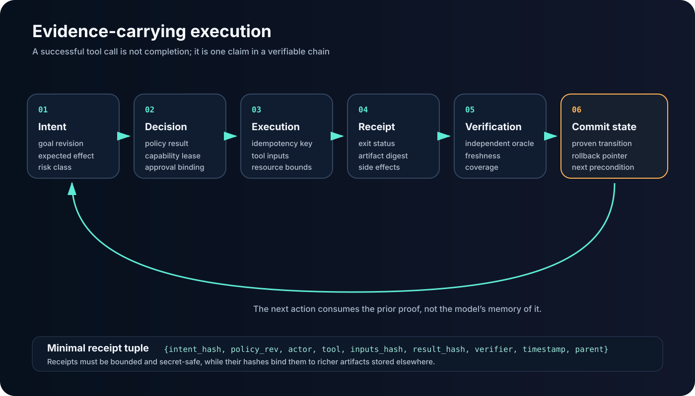

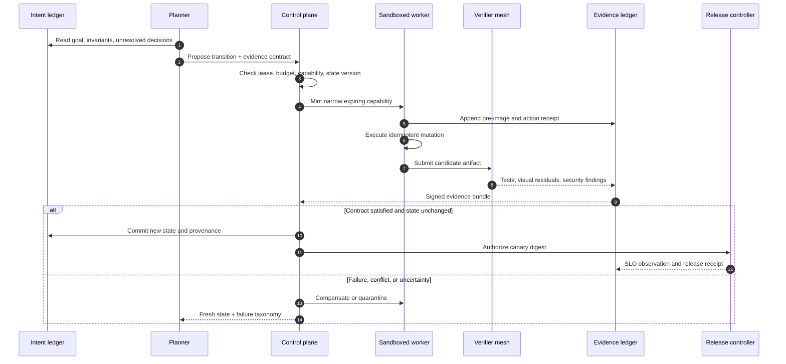

The coordinator itself is a reconciliation loop:

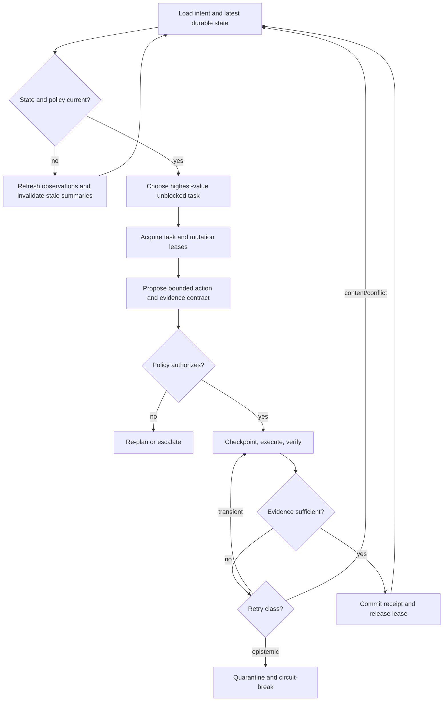

## Design decisions and trade-offs

| Approach | Strength | Failure boundary | Best use |
|---|---|---|---|
| Single prompt / chat | Lowest setup and latency | Context, authority, and evidence collapse into one transcript | Small reversible edits with a human holding state |
| Scripted workflow | Deterministic, auditable, inexpensive | Brittle when branches or observations are not anticipated | Known CI/CD and data-processing paths |
| Repository agent | Flexible search, edit, and test loop | Often process-local; evaluator and actor may be coupled | Issue resolution in an isolated repository |
| Durable control-plane agent | Crash recovery, policy, leases, evidence, multi-day continuity | Considerable infrastructure and operational complexity | Long projects with material side effects |

Several trade-offs resist universal answers.

**Immutable history versus privacy.** Full replay improves diagnosis but stores prompts, code, and possibly personal or secret data. Use field-level encryption, retention classes, redaction before persistence, and cryptographic erasure of wrapped keys. Some observations should never enter the model-visible log.

**Independent verification versus latency.** Redundant runners and shadow reviews reduce correlated errors but increase queue time. Risk-price them. Do not run the same model twice with the same context and call the results independent.

**Determinism versus learning.** Reproducible workflows want stable policies; adaptive agents want to update tactics. Separate the “constitution” from the “playbook.” Learning may update retrieval weights, tool selection, test ordering, and cost estimates. It may not grant new authority or weaken an invariant.

**Large context versus focused state.** A 991K-token window can hold more evidence but also more stale assumptions, injection surface, and attention competition. Prefer a small verified working set linked to content-addressed sources.

**Agent-generated tests versus evaluator independence.** Generated tests accelerate development but can encode the same misunderstanding as the patch. Preserve owner-provided acceptance tests, mutation testing, held-out cases, and outcome signals the planner cannot edit.

## Scaling strategy: parallel search, serialized truth

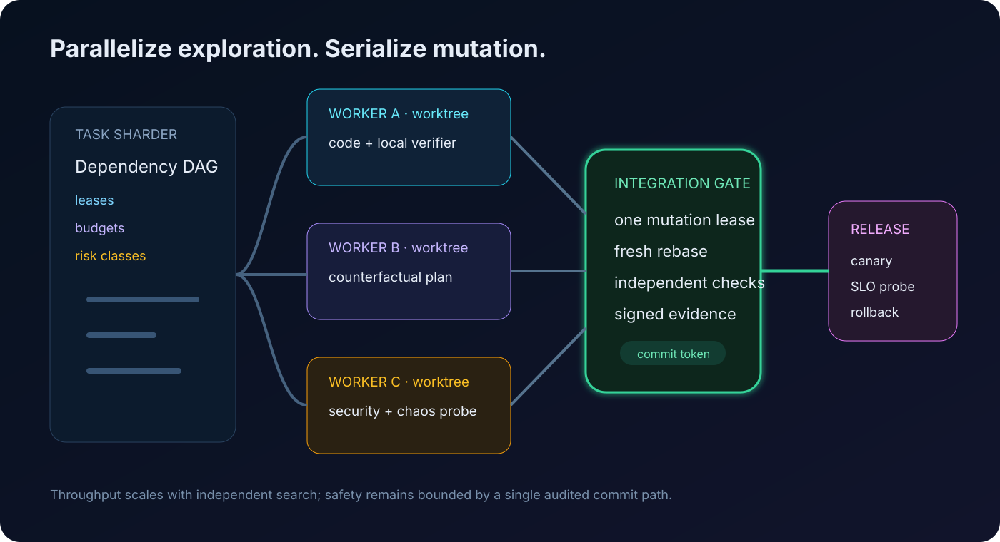

Scale at the dependency graph, not by letting many agents share a checkout. Independent workers receive immutable base digests and isolated worktrees or containers. Each owns a lease, budget, and output namespace. They can explore implementation alternatives, generate tests, inspect security, or reproduce a failure concurrently.

Integration remains serialized through a narrow gate. The gate rebases against current truth, reruns affected checks, rejects overlapping ownership, and issues the only commit token. This resembles database multi-version concurrency control: speculative work scales horizontally, but conflicting writes are validated at commit.

Little's Law gives a useful capacity bound:

\[
L=\lambda W,
\]

where \(L\) is work in progress, \(\lambda\) accepted task throughput, and \(W\) average residence time. Adding agents increases \(L\) immediately; if the integration/verifier service cannot raise \(\lambda\), residence time and staleness grow. A fleet that “looks busy” may lower delivered throughput because every long-lived branch becomes more expensive to rebase and revalidate.

Practical scheduling should therefore account for:

- critical-path length and expected information gain;
- mutation overlap and shared external resources;
- verifier capacity, not just model capacity;
- token, tool, and wall-clock budgets;
- failure correlation across models, prompts, and environments;
- freshness deadlines for observations.

Use separate queues for read-only research, speculative coding, authoritative mutation, and release. Backpressure should stop new speculation when the evidence or integration queues saturate.

## Cost optimization: price uncertainty, not tokens alone

Qwen's official model page lists input at $2.00 per million tokens, output at $6.00, and implicitly cached input at $0.25. The nominal token cost is

\[
C=2U_f+0.25U_c+6O \quad \text{dollars per million tokens},
\]

for fresh input \(U_f\), cached input \(U_c\), and output \(O\).

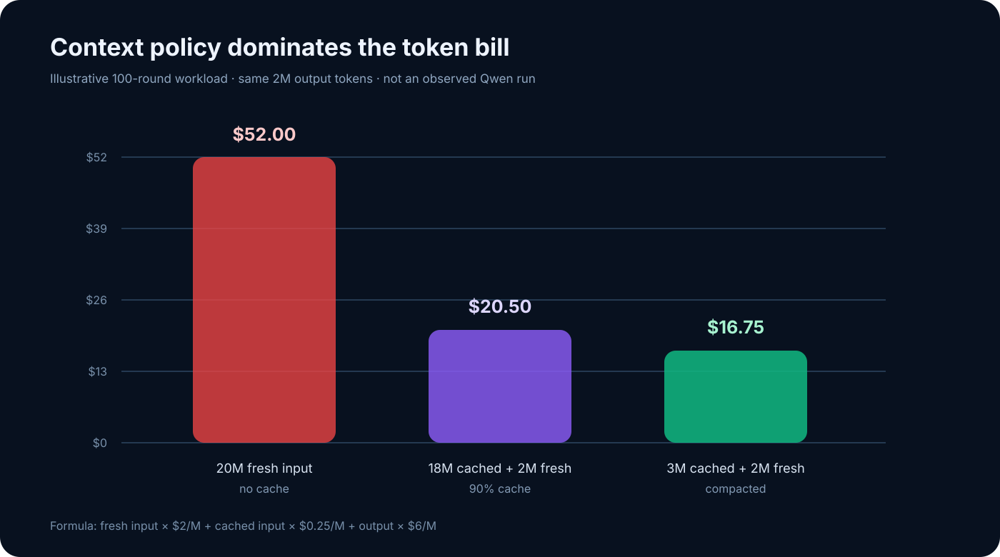

For an illustrative 100-round job with 20M cumulative input tokens and 2M output tokens, replaying all input as fresh costs $52. If 90% qualifies for implicit caching, it costs $20.50. If deterministic compaction reduces input to 3M cached plus 2M fresh, the total is $16.75. These are workload assumptions, not observed costs of the public trace.

Token optimization should not create correctness debt. The control objective is closer to

\[
\min \; C_{\text{model}}+C_{\text{tools}}+C_{\text{delay}}+
\mathbb{E}[C_{\text{escaped failure}}].
\]

Cheap practices include stable prompt prefixes to maximize caching, content-addressed retrieval, schema-constrained outputs, summary refresh by change set, small models for classification and log normalization, and early deterministic checks. Expensive models belong at ambiguous design forks and high-impact diagnosis—not at every heartbeat.

METR's [expenditure-horizon framing](https://metr.org/blog/2026-07-21-expenditure-horizon/) is helpful: capability depends on the compute and attempts an operator can afford, not only single-run success. Infrastructure should record cost per accepted evidence contract and cost per merged outcome, not merely tokens per request.

## Security: assume the environment is trying to program the programmer

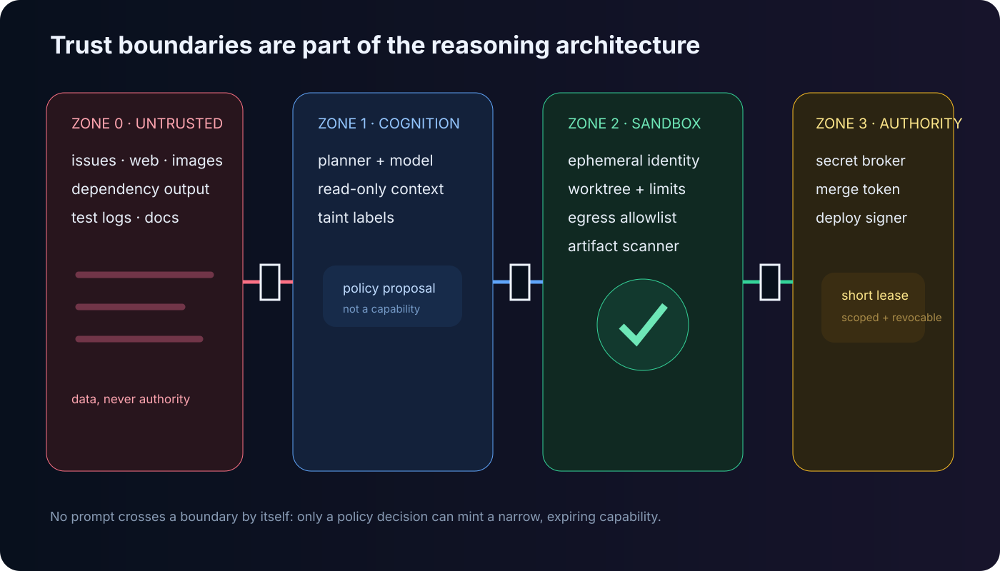

Prompt injection in agent systems is a confused-deputy problem. A malicious issue, README, web page, image, test log, or package post-install message can supply text that resembles instructions. If the model also holds credentials and broad tools, data becomes authority.

The defense is architectural:

1. **Separate data from control.** Only signed policy and the intent ledger may alter objectives or grant capability.
2. **Use least privilege and ephemeral identity.** Each action gets a narrow token bound to resource, operation, environment, and expiry.
3. **Sandbox execution.** Default-deny network, immutable base images, resource limits, syscall policy, and per-task filesystem namespaces.
4. **Broker secrets.** Deliver them directly to the authorized process; redact output and prevent model-visible echo.
5. **Gate side effects.** Merges, deployment, payments, deletion, customer communication, and production data access require higher assurance.
6. **Preserve provenance.** Every observation and artifact records origin and transformations.
7. **Detect exfiltration and persistence.** Scan patches, artifacts, dependencies, hooks, generated binaries, and outbound destinations.

The [OWASP AI Agent Security Cheat Sheet](https://cheatsheetseries.owasp.org/cheatsheets/AI_Agent_Security_Cheat_Sheet.html) provides a useful operational baseline. NIST's work on [agent hijacking evaluation](https://www.nist.gov/news-events/news/2025/01/technical-blog-strengthening-ai-agent-hijacking-evaluations) underscores that attacks must be tested as end-to-end behavior, not only prompt classification. OpenAI's [prompt-injection guidance](https://openai.com/index/designing-agents-to-resist-prompt-injection/) likewise argues for constraining impact even when manipulation succeeds.

One subtle threat is **goal laundering**: an untrusted source persuades the planner to add a seemingly reasonable subgoal, which later justifies a privileged action. Bind every goal-graph node to provenance and require a governed diff when the graph changes. Another is **evaluator capture**: the agent edits the test or dashboard that defines success. Keep critical evaluators in a protected plane and sign their versions.

## Deployment patterns

Production adoption should progress by authority, not by enthusiasm.

**Read-only observer.** The agent inventories systems, builds dependency graphs, reproduces incidents, and proposes evidence contracts. It has no mutation capability.

**Ephemeral builder.** It may create artifacts inside isolated environments and open reviewable changes. Humans own merge and release. This is the appropriate default for most organizations.

**Guarded integrator.** It receives a commit token only after independent checks, ownership validation, and rebase. Deployment remains staged.

**Canary operator.** It can release an immutable digest to a narrow cohort, observe predeclared SLOs, and automatically roll back. It cannot widen the cohort or change the SLO during the run.

**Bounded service owner.** Mature systems may allow autonomous remediation for a catalog of reversible incidents. New failure classes trip an epistemic circuit breaker and return authority to humans.

The infrastructure stack typically includes a durable workflow service; append-only event and evidence stores; object storage for content-addressed artifacts; an identity-aware capability broker; sandboxed execution pools; repository/worktree leasing; a verifier farm; policy-as-code; observability; and a release controller. Multi-region operation requires explicit ownership of the mutation lease and fencing tokens, not “best effort” distributed locks.

## Performance benchmarks: measure the system, not the theater

A serious evaluation suite has at least five axes:

| Axis | Metric | What it reveals |
|---|---|---|
| Outcome | held-out task success; production defect escape | Whether useful work survived independent evaluation |
| Horizon | success versus human-expert task duration | How reliability decays with dependency depth |
| Recovery | crash injection recovery time; duplicate side effects | Whether durability and idempotency are real |
| Efficiency | cost and wall time per accepted evidence contract | Whether more attempts buy useful certainty |
| Governance | unauthorized-action rate; provenance coverage; rollback success | Whether the control plane bounds harm |

Fresh tasks matter because public repositories leak into training and agent scaffolds. [SWE-bench-Live](https://arxiv.org/abs/2505.23419) was designed around continuously updated, post-cutoff issues for this reason. Long-horizon evaluation should additionally hide critical acceptance tests, inject dependency and environment changes, kill workers mid-action, corrupt derived summaries, rotate credentials, and introduce adversarial tool output.

The local `oh-my-cli` results reported here are **artifact validation**, not a model benchmark. They establish that the inspected tree builds and its tests pass under a documented environment. A defensible Qwen capability result would need frozen model identifiers, prompts, tool policies, complete event logs, token and intervention accounting, independent held-out evaluators, and repeated trials with confidence intervals.

## Failure modes and unresolved problems

**Correlated verification.** Actor, reviewer, and test generator may share the same blind spot. Diversity must include data, model, prompt, environment, and outcome channel.

**Specification gaming.** The agent satisfies the measurable proxy while violating intent. Evidence contracts reduce but do not eliminate this; some qualities—maintainability, organizational fit, long-term safety—are weakly observable.

**Memory poisoning.** A false summary can persist longer than the input that caused it. Digest validation protects integrity, not truth. Periodically reconstruct key beliefs from primary evidence and use contradiction probes.

**Environmental non-stationarity.** APIs, repositories, prices, teams, and customer behavior change during the run. Freshness must be encoded in evidence, and plans must tolerate invalidation.

**Self-modifying evaluators.** An agent that can alter its tests, telemetry, policy, or reward can create the appearance of improvement. Protected evaluators and separation of duties are essential.

**Long-horizon credit assignment.** A production regression may originate hundreds of actions earlier. Event provenance helps locate candidates, but learning which policy decision caused the outcome remains an open causal-inference problem.

**Human attention collapse.** Asking a person to approve hundreds of low-context diffs is not governance. Escalations should be rare, bundled around consequential decisions, and include a replayable evidence packet plus explicit alternatives.

**Institutional mismatch.** Code can be correct while violating ownership, compliance, operational maturity, or product strategy. These constraints are often tacit and absent from repositories.

**Benchmark-to-production transfer.** Closed repositories have uncertain dependencies, flaky tests, private infrastructure, and consequential data. Public issue resolution is a useful component task, not a deployment certificate.

## Future directions

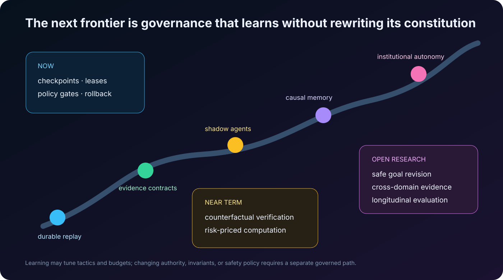

The most promising advances may arrive around the model rather than solely inside it.

**Evidence-carrying patches.** A change artifact includes machine-checkable preconditions, invariant proofs or tests, environment digest, provenance, expected telemetry, and compensation. CI verifies the evidence bundle instead of rediscovering its structure.

**Causal memory.** Instead of storing “we chose Redis,” memory stores the decision graph: evidence, alternatives, assumptions, predicted outcomes, and later observations. When an assumption expires, the system can identify downstream decisions that need reconsideration.

**Counterfactual execution markets.** Several isolated workers bid predicted cost, time, and risk for alternative plans. A scheduler funds a diverse portfolio, stops dominated trajectories early, and retains evidence from failed branches. The goal is not debate theater but measurable information gain.

**Epistemic circuit breakers.** Repeated contradictions, unexplained visual residuals, verifier disagreement, or environment drift automatically reduce authority and expand observation. Failure changes the control regime instead of merely increasing retry count.

**Capability-credit ledgers.** Autonomy is earned at the granularity of action classes. Repeated verified performance can expand budgets for reversible staging changes, while a single policy violation contracts authority. Credits cannot cross trust domains: skill at CSS does not grant database deletion rights.

**Multimodal digital twins.** For chip design, robotics, browser systems, and infrastructure, the agent operates against a continuously observed twin. In EDA, for example, synthesis and physical-design tools such as Yosys and OpenROAD can expose area, timing, congestion, and power as feedback; projects including [AuDoPEDA](https://arxiv.org/abs/2601.06268) and [MCP4EDA](https://arxiv.org/abs/2507.19570) explore agentic loops around such tools. The hard problem is preventing the optimizer from exploiting an incomplete simulator or constraint set.

**Constitutional versioning.** An autonomous system may learn playbooks, but changes to authority and invariants should travel through a separate, slower governance workflow with formal diffs, adversarial review, staged rollout, and rollback. A system that can freely rewrite its constitution is not self-improving infrastructure; it is an unbounded principal.

## Closing perspective

The interesting claim behind ten-day autonomous coding is not that a model can keep emitting tokens for ten days. Processes have always been able to run. The claim is that useful intent can survive hundreds of uncertain state transitions.

The public `oh-my-cli` trace offers a credible architectural sketch: bounded rounds inside an unbounded coordinator, durable event history, validated summaries, scoped worktrees, reversible turns, multimodal hygiene, and explicit governance. Its test suite makes that sketch inspectable. It does not settle generality, production safety, or the vendor's broader long-horizon claims.

For senior engineering teams, that is enough to change the design question. Stop asking, “Which model can finish our project?” Ask instead:

> What deterministic control plane would let a fallible but increasingly capable model work for ten days without losing intent, exceeding authority, hiding uncertainty, or making recovery harder than the original task?

Build that substrate, and model improvements become usable leverage. Skip it, and a longer horizon merely gives failure more time to compound.

## References

### Primary product and trace sources

- Qwen, [Qwen3.8-Max model page](https://www.qwencloud.com/models/qwen3.8-max) — specifications and pricing.
- Qwen, [Qwen3.8 launch blog](https://qwen.ai/blog?id=qwen3.8) — vendor-reported capability claims.
- `qwen-code-dev-bot`, [`oh-my-cli` repository](https://github.com/qwen-code-dev-bot/oh-my-cli) and audited [`AUTONOMY.md`](https://github.com/qwen-code-dev-bot/oh-my-cli/blob/97c9f5f33b43c52c712634599b81e40262ac5603/AUTONOMY.md).
- OpenAI, [Unrolling the Codex agent loop](https://openai.com/index/unrolling-the-codex-agent-loop/) and [Introducing upgrades to Codex](https://openai.com/index/introducing-upgrades-to-codex/).
- Anthropic, [Building Effective Agents](https://www.anthropic.com/engineering/building-effective-agents) and [The case for making AI agents trustworthy](https://www.anthropic.com/research/trustworthy-agents).

### Evaluation and agent systems

- Jimenez et al., [SWE-bench](https://arxiv.org/abs/2310.06770), 2023.
- Yang et al., [SWE-agent](https://arxiv.org/abs/2405.15793), 2024.
- Wang et al., [OpenHands](https://arxiv.org/abs/2407.16741), 2024.
- Xiao et al., [SWE-bench-Live](https://arxiv.org/abs/2505.23419), 2025.
- Zhou et al., [WebArena](https://arxiv.org/abs/2307.13854), 2023.
- Koh et al., [VisualWebArena](https://arxiv.org/abs/2401.13649), 2024.
- Xie et al., [OSWorld](https://arxiv.org/abs/2404.07972), 2024.
- METR, [Measuring AI Ability to Complete Long Tasks](https://metr.org/blog/2025-03-19-measuring-ai-ability-to-complete-long-tasks/), [time-horizon methodology](https://metr.org/time-horizons/), and [Expenditure Horizon](https://metr.org/blog/2026-07-21-expenditure-horizon/).

### Systems and security foundations

- Kubernetes, [Controllers](https://kubernetes.io/docs/concepts/architecture/controller/).
- Temporal, [Workflow execution](https://docs.temporal.io/workflow-execution) and [Retry policies](https://docs.temporal.io/encyclopedia/retry-policies).
- Martin Fowler, [Write-Ahead Log](https://martinfowler.com/articles/patterns-of-distributed-systems/write-ahead-log.html).
- OWASP, [AI Agent Security Cheat Sheet](https://cheatsheetseries.owasp.org/cheatsheets/AI_Agent_Security_Cheat_Sheet.html).
- NIST, [Strengthening AI agent hijacking evaluations](https://www.nist.gov/news-events/news/2025/01/technical-blog-strengthening-ai-agent-hijacking-evaluations), 2025.
- OpenAI, [Designing AI agents to resist prompt injection](https://openai.com/index/designing-agents-to-resist-prompt-injection/).
- OpenROAD, [Getting Started Guide](https://openroad-test.readthedocs.io/en/stable/user/GettingStarted.html).

---

### Visual provenance

The quantitative diagrams are original SVGs built from the repository audit and stated assumptions. The two raster illustrations were generated specifically for this article: a toonified autonomous workshop and a hand-drawn reliability loop. Their final generation prompts are recorded in [`assets/IMAGE-PROMPTS.md`](assets/IMAGE-PROMPTS.md).
