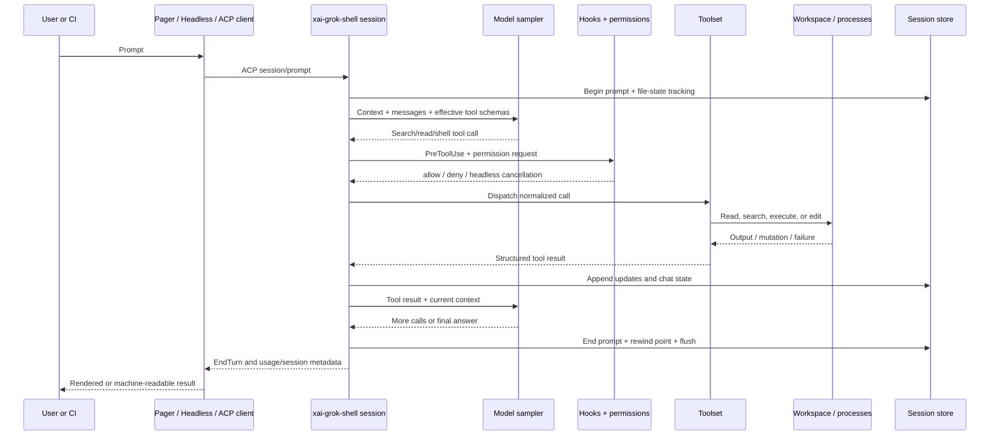

# Grok Build Research Dossier

## Research scope and repository version

| Item | Recorded value |
|---|---|
| Research date | 2026-07-16 |
| Repository | `xai-org/grok-build` |
| Default branch | `main` |
| Researched commit | `c68e39f60462f28d9be5e683d9cbe2c57b1a5027` |
| Public commit date | 2026-07-16 |
| Pi comparison snapshot | `badlogic/pi-mono` `main` at `97f9978fa66685f78d2da19ae22e20c46d125f74` |
| Hermes comparison snapshot | `NousResearch/hermes-agent` `main` at `c9c9bb33fcc6ab479846a1c496a6e9efe2c1c7d4` |

The Grok Build public repository contained one visible commit at research time: “Publish harness and TUI open-source.” That makes the tree a useful implementation snapshot but the public history a poor source for architectural evolution. Intent claims that would normally be supported by commit history are therefore omitted or labelled as inference.

The repository describes a released `grok` command, while the source composition root builds the `xai-grok-pager` binary. Hosted model serving, account infrastructure, and other xAI backend internals are outside the public tree. This dossier does not infer them.

Primary evidence used: repository source, README, local user guide, Cargo manifests, tests near relevant modules, license notices, and first-party project documentation. Official online documentation is treated as supplementary because the commit-pinned tree is the reproducible source snapshot.

## A. Executive summary

Grok Build is a terminal coding agent, but “terminal coding agent” understates what the repository implements. The public tree contains a full-screen interface, an agent runtime, model streaming, tool schemas and implementations, a workspace boundary, permissions, OS-level sandbox profiles, session persistence, rewind, memory retrieval, extension discovery, subagents, background work, headless output, and an ACP server. The useful unit of analysis is therefore not a CLI calling a model. It is a model–harness–environment system.

The series’ governing equation is:

> **Coding-agent effectiveness = model capability × harness quality × environment quality × verification quality**

The multiplication sign matters. A capable model cannot edit a repository without a harness that exposes tools. A good harness cannot repair code if its environment lacks dependencies or credentials. Both can still produce a confident failure if no test, diff review, or acceptance check closes the loop.

The composition root is `crates/codegen/xai-grok-pager-bin/src/main.rs`. It resolves CLI modes and connects user-facing clients to shared runtime paths. Interactive work uses the pager/TUI. `grok -p` uses the headless client, which starts the shell in-process and speaks ACP lifecycle messages to it. `grok agent stdio` exposes a persistent JSON-RPC ACP server for editors and custom clients. These are different clients around substantially shared session and turn machinery, not three unrelated agents.

The central runtime behavior lives in `xai-grok-shell`, especially `session/acp_session_impl/turn.rs`. A prompt becomes conversation state, selected instructions and skills, tool definitions, and a streamed model request. If the response contains tool calls, the runtime normalizes arguments, applies hooks and permission policy, dispatches through the tool/workspace boundary, records results, and asks the model again. A no-tool response normally ends the turn, subject to todo/goal gates and queued interjections. This is an important completion boundary: ordinary turns do not have a general semantic proof that the bug is fixed. Verification quality still depends on the task, tools the model chooses, explicit acceptance criteria, and any harness gates configured around the run.

`xai-grok-tools` separates model-facing tool definitions from runtime implementations. `ToolDefinition` carries a function name, description, and JSON parameters. A finalized toolset resolves and calls implementations with a `SessionContext`. Effective tools are dynamic: agent definition, capability mode, CLI filters, configuration, MCP availability, and runtime features can change what the model sees. It is therefore inaccurate to describe one permanent built-in tool list.

The workspace layer is more than a filesystem helper. `xai-grok-workspace` binds a toolset to a session, selects local or proxied operations, manages execution and repository state, and supplies file-state tracking used by rewind. That boundary makes the same higher-level agent loop usable against a local directory or a workspace service. It also gives state mutation a place to be observed and persisted.

Authorization is layered. A `PreToolUse` hook may explicitly deny a call. Permission rules then apply with `deny > ask > allow`, followed by remembered grants, built-in read-only approvals, and the mode’s prompt policy. Headless calls that would require interaction are cancelled and reported back to the model. `dontAsk` is deny-by-default for calls without an allow or built-in approval. `bypassPermissions`/`--yolo` is broad auto-approval, not isolation. Explicit deny rules and relevant hooks remain meaningful, but the mode deliberately removes most human stops.

Sandboxing is a separate OS boundary and is off by default. Built-in profiles restrict reads/writes using Landlock-related mechanisms on Linux and Seatbelt on macOS. Linux can restrict child-process networking with seccomp; the guide states that macOS child-network restriction is a no-op. In-process LLM, web, and similar HTTP operations remain reachable. A sandbox therefore constrains certain process capabilities; it does not validate commands, prevent prompt injection, or prove that a permitted edit is correct.

Context comes from several independently governed sources. `AGENTS.md` discovery walks from root toward the working directory, with deeper instructions later and therefore higher precedence. Skills are reusable prompt packages discovered from Grok-native and compatibility paths. Plugins package skills, agents, hooks, MCP, and LSP configuration, with a trust boundary for executable components. MCP adds external tools, normally surfaced through namespaced discovery and dispatch. Experimental project memory persists Markdown plus search indexes and can inject recalled material on the first turn and after compaction. These mechanisms should not be collapsed into “plugins”: they differ in who invokes them, what they can execute, and how long their state lives.

Sessions are durable artifacts under `~/.grok/sessions`. JSONL update and chat streams, summaries, plans, rewind points, feedback, signals, and subagent data support resume and inspection. Rewind stores per-prompt file snapshots and truncates conversation state when invoked. Some broader checkpoint modes are feature-gated; the safe claim is that file-state rewind is implemented, not that every repository mutation is transactionally reversible.

Compared with Pi, Grok Build chooses a much larger built-in operational surface and stronger Rust subsystem boundaries. Pi’s current core remains deliberately small—four default tools, extension-driven behavior, interactive/print/RPC/SDK modes, and JSONL session trees. Compared with Hermes, Grok Build is more specifically organized around software workspaces, terminal/editor use, and coding-agent safety boundaries. Current Hermes has grown beyond the narrower system described in the old series: it now advertises memory and skill improvement, messaging gateways, cron, subagents, MCP, many tools, providers, and several execution backends. These are different optimization points, not a ranking.

The reusable lesson is architectural. Model intelligence is only one term. Grok Build invests heavily in the contracts around intelligence: what context is selected, which actions exist, where they execute, what policy gates them, what evidence is retained, and which client can drive the loop. Its public repository is most valuable as a study of those contracts—and of the places where configuration and operator discipline still determine the outcome.

## B. Architecture map

All paths below are repository-relative and pinned to the researched Grok Build commit.

| Responsibility | Main crate or module | Important files or symbols | Runtime role | Evidence | Confidence |
|---|---|---|---|---|---|
| CLI composition | `xai-grok-pager-bin` | `src/main.rs`; `main`; `run_agent_command` | Parses modes and composes pager, headless, and ACP paths | Source | High |
| Interactive UI | `xai-grok-pager` | pager app and rendering modules | Owns full-screen terminal interaction and renders streamed session updates | Source + guide | High |
| Headless client | `xai-grok-pager/src/headless.rs` | `run_single_turn`; `spawn_grok_shell` | Drives ACP initialize/auth/session/prompt in-process; emits plain/JSON/JSONL | Source | High |
| ACP server modes | `xai-grok-shell/src/agent/app.rs` | `run_stdio_agent`; `run_headless`; `run_leader` | Hosts persistent agent protocol transports and shared shell services | Source | High |
| Prompt lifecycle | `xai-grok-shell` | `session/acp_session_impl/turn.rs`; `handle_prompt` | Resolves prompt context, starts persistence, runs model/tool loop | Source | High |
| Model loop | `xai-grok-shell` + `xai-grok-sampler` | `process_conversation_turn`; `run_turn_via_sampler` | Builds a model request, streams response, retries selected transport/context failures | Source | High |
| Conversation state | `xai-chat-state` | request/chat state APIs used in `turn.rs` | Stores messages, tool results, compaction state, and request construction | Source | High |
| Agent definition and prompt | `xai-grok-agent` | `prompt/context.rs::PromptContext`; builder/definition modules | Selects system prompt, agent tools, skills, personas, and working context | Source | High |
| Project rules | `xai-grok-agent` | `prompt/agents_md.rs` | Discovers layered `AGENTS.md`/rule files and formats reminders | Source + tests | High |
| Tool schema | `xai-grok-tools` | `types/definition.rs::ToolDefinition` | Presents function name, description, and JSON parameters to the model | Source | High |
| Tool runtime | `xai-grok-tools` | `registry/types.rs::FinalizedToolset`; `SessionContext` | Resolves implementations and supplies per-session dependencies | Source | High |
| Tool-call policy path | `xai-grok-shell` | `tool_calls.rs::prepare_tool_call` | Normalizes input, runs pre-hook, requests permission, executes, records result | Source | High |
| Workspace dispatch | `xai-grok-workspace` | `workspace_ops.rs::WorkspaceOps`; `bind_local_session`; `call_tool` | Routes local or proxy operations and binds session toolsets | Source | High |
| Same-file serialization | `xai-grok-shell` | `tool_dispatch.rs::lock_path_for_args` | Allows concurrency while serializing calls targeting the same path | Source | High |
| Permissions | `xai-grok-workspace` | `permission/manager.rs::PermissionManager::request` | Evaluates mode, rules, built-in approval, and remembered decisions | Source + guide | High |
| Hooks | `xai-grok-hooks` + shell | `PreToolUse` dispatch in `tool_calls.rs` | Adds lifecycle callbacks; only explicit pre-tool deny blocks an action | Source + guide | High |
| Sandbox | `xai-grok-sandbox` | `profiles.rs::SandboxProfile`; deny modules | Applies process-lifetime filesystem policy and platform-specific restrictions | Source + guide | High |
| File rewind | `xai-grok-workspace` | `session/file_state.rs::RewindPoint`; `checkpoint.rs::RewindCheckpoint` | Captures before/after prompt file state for later restoration | Source | High |
| Session persistence | shell/pager persistence modules | `updates.jsonl`, `chat_history.jsonl`, `rewind_points.jsonl` contracts | Enables resume, search, rewind, plan persistence, and audit artifacts | Source + guide | High |
| Compaction | `xai-grok-compaction` | `code_compaction/assemble.rs` | Reduces conversation context and reintroduces durable instructions | Source | High |
| Project memory | `xai-grok-memory` | `storage.rs`; `search.rs`; `dream.rs` | Experimental Markdown-backed memory, indexed retrieval, optional consolidation | Source + guide | High |
| Skills | agent/config discovery | `SKILL.md` discovery; `/create-skill` | Supplies task-specific instructions and supporting resources | Source + guide | High |
| Plugins | plugin/config modules | plugin manifest and discovery paths | Bundles skills, commands, agents, hooks, MCP, and LSP config | Source + guide | High |
| MCP | `xai-grok-mcp` + tool bridge | namespaced `server__tool`; `search_tool`; `use_tool` | Discovers and invokes external stdio/HTTP/SSE tools | Source + guide | High |
| Plan mode | shell session tracker | `enter_plan_mode`; `exit_plan_mode`; edit gate in `tool_calls.rs` | Creates a reviewable plan and blocks non-plan edit tools while active | Source + guide | High |
| Subagents | shell/workspace session code | `spawn_subagent`; capability modes; `resume_from` | Runs independent child contexts at one level of depth | Source + guide | High |
| Background work | command/subagent lifecycle modules | output/wait/kill tools; scheduler/monitor APIs | Keeps commands and delegated work alive while the main turn continues | Source + guide | High |
| Third-party tool code | `xai-grok-tools` | `THIRD_PARTY_NOTICES.md`; `implementations/codex`; `implementations/opencode` | Adapts specific file/search/edit/bash tool implementations | Notice + source | High |
| Hosted model/account services | Outside public repository | N/A | Authentication/model serving behavior beyond client contracts | Not public | Unknown |

## C. End-to-end execution trace

Representative request: “Find the failing test, fix the implementation, run the relevant tests, and summarize the change.”

1. **Input.** The pager collects interactive input; headless mode accepts `-p`; ACP clients send a prompt request. `xai-grok-pager-bin/src/main.rs` chooses the client path.
2. **Client lifecycle.** `xai-grok-pager/src/headless.rs::run_single_turn` loads effective configuration, spawns the shell, performs ACP initialize/auth, creates or resumes a session, and sends the prompt. Interactive and external ACP clients reach the same shell-level protocol through different transports.
3. **Session state.** `xai-grok-shell/.../turn.rs::handle_prompt` resolves commands and skills, increments the prompt index, starts `file_state_tracker.begin_prompt`, persists user chunks, and pushes a user message into chat state.
4. **Context assembly.** `PromptContext`, discovered rules, active skill content, memory reminders, conversation history, and effective tool definitions contribute to the request. Which items survive context pressure is governed partly by compaction, not by the raw prompt alone.
5. **Model request.** `process_conversation_turn` prepares tool definitions, builds the current request from chat state, and calls `run_turn_via_sampler`. The sampler streams text, thought, and tool-use events.
6. **Tool selection.** The model emits a function/tool call defined by `ToolDefinition`. Selection is a model output; availability is a harness decision.
7. **Preparation and authorization.** `tool_calls.rs::prepare_tool_call` parses and normalizes arguments, checks the plan-mode edit gate, dispatches `PreToolUse`, and calls the permission manager. A denied/cancelled call becomes a model-visible result rather than silently executing.
8. **Dispatch.** `tool_dispatch.rs::dispatch_tool` delegates to `WorkspaceOps::call_tool`. Local sessions call their finalized toolset; proxy sessions route through the workspace hub. Calls may run concurrently, while path locks serialize calls inferred to target the same file.
9. **Finding the failure.** The model can invoke search/read and a test command. Shell output is captured as a tool result. Background execution uses task IDs plus get/wait/kill operations rather than forcing the model call to block indefinitely.
10. **Editing.** An edit/write implementation changes the workspace only after the same hook/permission path. The file-state tracker records state around the prompt so rewind has before/after material.
11. **Feedback.** Success or failure, output, and hook annotations are written into chat state. The loop asks the model again. A failing test can therefore cause a new diagnosis/edit/test round without pretending the first action succeeded.
12. **Completion.** A response with no tool calls normally ends the turn after configured todo/goal/interjection checks. Special agent definitions can require a completion tool and retry with backoff. Ordinary coding turns have no universal semantic “tests prove task complete” oracle.
13. **Persistence.** On turn end the runtime flushes session state, ends prompt-level file tracking, and persists a rewind point. The client receives `EndTurn`, text, session/request IDs, and available usage/cost metadata.

## D. Terminology glossary

| Term | Repository-grounded meaning |
|---|---|
| Agent | A configured session: model, prompt, tools, capabilities, and runtime behavior—not the model alone. |
| Pager | The interactive full-screen terminal client and rendering layer. |
| Shell | The agent/session runtime that owns ACP-facing prompt turns and the model/tool loop. It is not merely a Unix shell. |
| Workspace | The execution and state boundary through which filesystem, tools, repository operations, and local/proxy sessions are mediated. |
| Tool definition | Model-visible function metadata: name, description, and JSON parameter schema. |
| Finalized toolset | Runtime mapping from effective definitions to callable implementations with session dependencies. |
| Session context | Runtime dependencies available to tool calls, including cwd, environment, terminal backend, filesystem, memory, and skill state. |
| Prompt turn | One user request plus the model/tool rounds it causes until a terminal stop or failure. |
| Plan mode | A session state that makes the plan file editable and rejects other edit-tool calls until approval; it is not a full process sandbox. |
| Capability mode | Coarse subagent tool filtering such as read-only, read-write, execute, or all. |
| Permission mode | Policy for unapproved calls: prompt, deny, accept edits, or broadly approve. |
| Sandbox profile | Process-lifetime OS filesystem/network capability configuration; off by default. |
| Rewind point | Prompt-indexed before/after file state used to restore files and align conversation history. |
| Compaction | Context reduction that summarizes/truncates conversation while reinjecting selected durable instructions. |
| Skill | A discoverable `SKILL.md` prompt package for a repeatable task, optionally with resources/scripts. |
| Plugin | An installable bundle that may contain skills, commands, agents, hooks, MCP, and LSP configuration. |
| Hook | Command or HTTP callback tied to lifecycle/tool events. Only explicit `PreToolUse` denial blocks tool execution. |
| MCP server | External tool provider connected over stdio or remote transports; tools are namespaced by server. |
| ACP | JSON-RPC protocol boundary for clients to create/load sessions, send prompts, receive updates, and handle permissions. |
| Leader | Shared shell service mode used to coordinate agent processes/workspaces; public client-facing details are narrower than the overall internal service. |

## E. Comparison matrix

Snapshots are date-pinned above. “Current” means the checked commit, not a permanent product property.

| Dimension | Grok Build | Pi Agent | Hermes Agent |
|---|---|---|---|
| Primary purpose | Coding agent for terminal, automation, and ACP clients | Minimal, extensible terminal coding harness and SDK | Broad self-improving personal/automation agent with coding capabilities |
| Main language | Rust | TypeScript | Python |
| Runtime architecture | Multi-crate client/runtime/tools/workspace split; local/proxy workspace paths | Small package core, extension system, SDK/RPC modes | Python agent runtime with tool suites, gateway, platform/backends |
| Interfaces | Full-screen TUI, headless, ACP stdio/server/relay | Interactive, print/JSON, RPC, SDK | CLI plus messaging/gateway and automation surfaces |
| Default tool philosophy | Broad, dynamically filtered coding/automation surface | Four core tools (`read`, `write`, `edit`, `bash`); extend explicitly | Broad advertised set (40+), including execution, research, messaging, memory |
| Extension model | Skills, plugins, hooks, MCP, commands, agents, LSP config | TypeScript extensions, skills, prompt templates, themes | Tools, skills, MCP, integrations, providers, backends |
| Memory | Experimental Markdown store + FTS/vector index + consolidation | Sessions/compaction; durable behavior commonly extension/project-context driven | First-class persistent memory and skill creation/improvement |
| Planning | Explicit plan mode and plan file | No built-in plan mode by design | Planning/delegation capabilities within broader agent system |
| Subagents | Built in; independent context, capability modes, worktree option, one-level depth | Not core; compose via extensions/processes | Built in and oriented toward broader delegation |
| Headless automation | Plain, JSON, streaming JSON; resume; tool filters; usage metadata | Print/JSON, RPC, SDK | CLI/gateway/cron and multiple execution backends |
| IDE integration | ACP JSON-RPC and extension methods | RPC/SDK can support custom integrations | Not the primary architectural center |
| Sandbox | OS-level profiles; off by default; platform caveats | No equivalent large built-in OS policy surface in core | Multiple terminal backends can isolate execution; guarantees depend on backend/configuration |
| Permission model | Layered rules, modes, remembered grants, hooks, interactive ACP prompts | Core stays smaller; host/extensions determine much policy | Policy depends on tool/backend/deployment configuration |
| Session persistence | JSONL artifacts, summaries, plans, rewind points, resume/search | JSONL session tree with branching/compaction | Persistent conversations/memory across interfaces |
| Observability | ACP update stream, TUI annotations, JSON output, usage/cost when available, session artifacts | JSON/RPC events and session data | Logs/gateway/tool execution surfaces; breadth depends on deployment |
| CI suitability | Strong headless contract but requires least-privilege CI envelope | Strong composability and scriptability; operator builds more policy | Strong automation reach; potentially larger attack/configuration surface |
| Custom models | User-guide/config provider support; runtime separates model selection from tool loop | Broad provider/model configuration | Broad provider support |
| Best fit | Teams wanting an integrated coding workspace with TUI, automation, and protocol embedding | Engineers wanting a small core they can understand and extend | Users wanting one agent across coding, research, messaging, and recurring automation |
| Main trade-off | Rich built-ins increase surface area and policy complexity | Minimal core shifts more integration and safety work to the adopter | Breadth and self-modification require careful operational governance |

Subjective conclusion: Grok Build is the most useful of the three as a source study of an integrated coding-workspace harness; Pi is the clearest study of deliberate minimalism; Hermes is the clearest study of a broad agent operating across channels. That is a choice of lenses, not a universal winner.

## F. Major-claims ledger

| Claim | Source file or official page | Exact evidence | Status | Confidence |
|---|---|---|---|---|
| Grok Build supports TUI, headless, and ACP operation | `README.md`; pager-bin `src/main.rs`; user guide 14/15 | Documented modes and dispatch symbols | Verified | High |
| Headless mode drives an in-process shell using ACP lifecycle calls | `xai-grok-pager/src/headless.rs`, module docs and `run_single_turn` | Shell spawn followed by initialize/auth/session/prompt requests | Verified | High |
| The main turn is an iterative model/tool loop | `xai-grok-shell/.../turn.rs::process_conversation_turn` | Request, sample, record tool calls, execute, append results, repeat | Verified | High |
| No-tool output normally ends an ordinary coding turn | Same function, no-tool branch | End-turn path after gates/interjections | Verified | High |
| Required-tool completion retry is conditional, not universal | `process_conversation_turn_with_recovery` | Enforcement depends on agent definition `completion_requirement` | Verified | High |
| Effective tool availability is dynamic | agent builder, tool registry, headless `--tools`/`--disallowed-tools`, MCP | Toolset built from config/capability/filter inputs | Verified | High |
| Tool calls pass through hooks and permission policy | `tool_calls.rs::prepare_tool_call`; permission manager | Pre-hook, permission request, execute/deny branches | Verified | High |
| `deny` outranks `ask`, which outranks `allow` | user guide `22-permissions-and-safety.md`; manager tests/code | Explicit rule precedence | Verified | High |
| Headless calls do not wait for interactive approval | user guide 22 line 88; headless permission handling | Would-prompt call cancelled/reported | Verified/documented | High |
| Sandbox is off by default | user guide `18-sandbox.md` lines 3–5; profile resolution | Explicit default | Verified | High |
| macOS profile network restriction is a no-op | user guide 18 lines 34, 183–190 | Explicit platform limitation | Verified/documented | High |
| Plan mode is not a complete write barrier | user guide 19 lines 128–135; edit gate in `tool_calls.rs` | Edit tools blocked; shell redirection not inspected; children have fresh tracker | Verified | High |
| Subagent nesting depth is one | user guide 16 and subagent runtime checks | Child cannot spawn child | Verified | High |
| Sessions persist JSONL and rewind artifacts | user guide 17; persistence code | Named files and append/flush paths | Verified | High |
| File rewind stores before/after prompt state | `xai-grok-workspace/src/session/file_state.rs::RewindPoint` | Before/after maps keyed to prompt | Verified | High |
| Memory is experimental and disabled by default | user guide 13; memory config | Explicit gate/default | Verified | High |
| Rules are layered root-to-cwd with deeper precedence | `xai-grok-agent/src/prompt/agents_md.rs` | Ordered discovery/formatting and tests | Verified | High |
| Plugins require trust before executable components run | user guide 09; plugin discovery/config | Skills may load; hooks/MCP/LSP gated by trust | Verified/documented | High |
| Specific tool code is adapted from Codex and OpenCode | `xai-grok-tools/THIRD_PARTY_NOTICES.md` | Lists adapted implementation directories/files | Verified | High |
| The whole runtime derives from Codex/OpenCode | No such evidence | Notices identify particular tools, not entire architecture | Rejected claim | High |
| Hosted xAI model-serving internals behave in a particular way | Not present in public tree | Client contracts only | Not verified | Unknown |

## Source-note convention for the series

Every article should use one of these forms:

> Source: `crates/.../file.rs`, `Type::method`, researched at Grok Build commit `c68e39f60462f28d9be5e683d9cbe2c57b1a5027`.

> Documented behavior; implementation path not yet verified: `crates/codegen/xai-grok-pager/docs/user-guide/...`.

> Architectural inference: the local/proxy boundary appears designed to keep the turn loop independent of workspace placement; the public snapshot does not include design-history evidence.

> Not verified from the public repository: hosted model routing and account-service internals.
