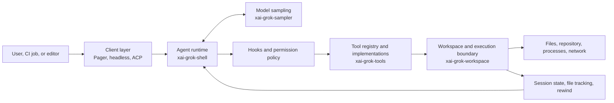
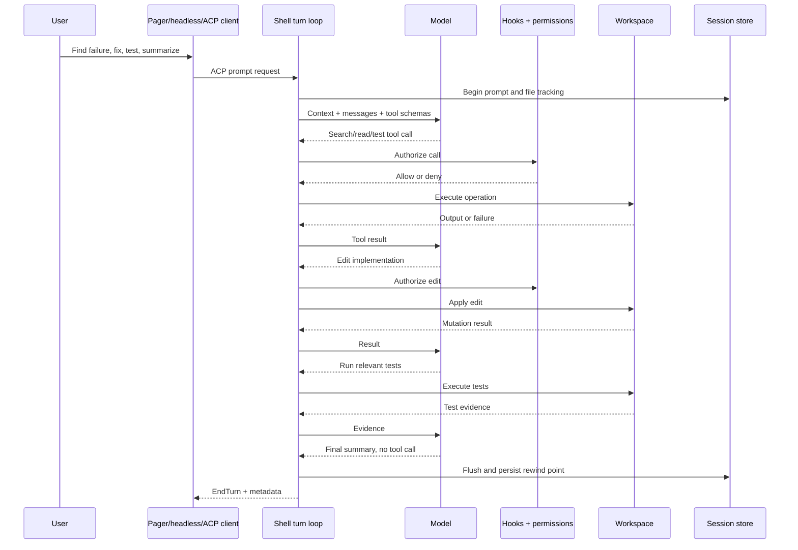

# Grok Build Is More Than a Coding CLI

*Inside the model, harness, environment, and verification system behind xAI's Rust coding agent.*

> **Series:** [Inside Grok Build](/series-grok-build) · Article 1 of 14
> **Previous:** [Harness Engineering: From Prototype to Production](/posts/harness-5-production)
> **Next:** Reading the Grok Build Rust Workspace

## TL;DR

Grok Build is a terminal coding agent. But the terminal is only its most visible client.

The public repository implements a larger system: a full-screen pager, an agent runtime, model streaming, tool definitions, file and shell operations, a workspace abstraction, session persistence, rewind, memory, permissions, OS-level sandboxing, extensions, subagents, headless automation, and an Agent Client Protocol server.

That system supports a stronger equation than “better model = better coding agent”:

> **Coding-agent effectiveness = model capability × harness quality × environment quality × verification quality**

A model can decide that a test should run. The harness must expose the shell tool, authorize it, start the process, capture its output, return the failure to the model, let the model edit the right file, and preserve enough state for the next round. The environment must contain the repository and toolchain. Verification must prove more than “the model stopped talking.”

This series will study those boundaries from source code. The snapshot is Grok Build `main` at commit `c68e39f60462f28d9be5e683d9cbe2c57b1a5027`, researched on July 16, 2026.

## The command line hides the real system

Imagine this request:

> Find the failing test, fix the implementation, run the relevant tests, and summarize the change.

The model does not directly read a repository. It does not own your shell. It cannot change a file by thinking about a patch.

Something around the model must do at least thirteen jobs:

1. Accept the request.
2. Discover project instructions.
3. Select conversation and repository context.
4. Tell the model which tools exist.
5. Parse the model's tool call.
6. Decide whether the action is allowed.
7. Execute the search, command, or edit.
8. Capture output and failures.
9. Feed the result back to the model.
10. Repeat until the model stops requesting tools.
11. Verify the resulting repository state.
12. Render a useful answer.
13. Save enough state to resume or rewind.

That surrounding system is the harness.

In [The Anatomy of an AI Coding Agent](/posts/harness-1-anatomy), I used the compact definition:

> **Agent = Model + Harness**

Grok Build lets us replace the compact definition with an implementation map. Its source shows where the user interface ends, where the prompt loop begins, where JSON tool intentions become operating-system effects, and where policy can stop them.

The distinction matters because most coding-agent failures are not pure reasoning failures. The right file may never enter context. A command may run in the wrong directory. An edit may succeed while the test never runs. A denied tool call may be mistaken for task completion. A remembered instruction may be stale. A successful local check may miss a CI-only dependency.

The model is one component in every example. It is not the whole explanation.

## A four-factor model of coding-agent effectiveness

The four factors interact multiplicatively:

| Factor | The question it answers | Example failure |
|---|---|---|
| Model capability | Can the model reason about this task? | It misdiagnoses an ownership error. |
| Harness quality | Can the system acquire context, expose actions, manage state, and recover? | It truncates the important compiler output. |
| Environment quality | Does the execution environment contain the right code, tools, permissions, and dependencies? | The required database or Rust target is absent. |
| Verification quality | Does evidence establish that the requested outcome was achieved? | One unit test passes while the workspace no longer builds. |

The multiplication metaphor is intentionally unforgiving. If a CI runner has no dependency access, better planning will not install the dependency. If the tool layer can edit but cannot report a failed command, the next model round reasons from false state. If no verifier checks the patch, fluent final prose can hide a regression.

This gives us a useful way to read the repository. Do not ask only, “Which model does Grok Build call?” Ask:

- How does it construct the request?
- Which tools does this agent actually see?
- Where will those tools run?
- Which state survives the next round?
- Which boundary enforces the permission?
- What evidence distinguishes completion from abandonment?

Those are harness-engineering questions.

## The high-level architecture

The repository is a large Rust workspace. We will map it precisely in Article 2, but six responsibility groups explain the main path.

### 1. The composition root

`crates/codegen/xai-grok-pager-bin/src/main.rs` is the binary composition root. It parses commands and selects interactive, headless, stdio-agent, server, or related service paths.

This file is not “the agent.” It is where independently implemented subsystems are assembled.

> Source: `crates/codegen/xai-grok-pager-bin/src/main.rs`, `main` and `run_agent_command`, researched at Grok Build commit `c68e39f60462f28d9be5e683d9cbe2c57b1a5027`.

### 2. The client layer

`xai-grok-pager` supplies the interactive terminal experience and a headless client. The headless path is especially revealing: `run_single_turn` loads configuration, starts the Grok shell in-process, performs the ACP initialize and authentication lifecycle, creates or loads a session, sends a prompt, and projects streamed updates into plain text, one JSON object, or newline-delimited streaming JSON.

That means `grok -p` is not a completely separate “simple agent.” It is a client of the same protocol-oriented runtime.

> Source: `crates/codegen/xai-grok-pager/src/headless.rs`, `run_single_turn` and module-level lifecycle documentation.

### 3. The agent runtime

`xai-grok-shell` owns the central prompt lifecycle. In `session/acp_session_impl/turn.rs`, `handle_prompt` resolves commands and skills, begins prompt-level file tracking, persists user input, updates chat state, and enters the conversation loop.

`process_conversation_turn` then prepares effective tool definitions, builds a model request, streams a response, executes any tool calls, appends their results, and samples again.

This is the engine room. The pager can render a tool card, but the shell decides how the tool result becomes the next model input.

> Source: `crates/codegen/xai-grok-shell/src/session/acp_session_impl/turn.rs`, `handle_prompt`, `process_conversation_turn_with_recovery`, and `process_conversation_turn`.

### 4. The tool layer

In `xai-grok-tools`, `ToolDefinition` describes a model-visible function with a name, optional description, and JSON parameter schema. A `FinalizedToolset` connects effective definitions to runtime implementations. Its `SessionContext` carries dependencies such as the current directory, environment, terminal backend, filesystem, memory backend, and skill state.

The available toolset is not one immutable list. Agent type, capability mode, command-line filters, configuration, MCP servers, and runtime features can change what the model sees.

This is the practical boundary between reasoning and action:

- The model emits structured intent.
- The harness validates and authorizes it.
- An implementation causes the side effect.

> Source: `crates/codegen/xai-grok-tools/src/types/definition.rs`, `ToolDefinition`; `crates/codegen/xai-grok-tools/src/registry/types.rs`, `FinalizedToolset` and `SessionContext`.

### 5. The workspace layer

`xai-grok-workspace` mediates operations against the actual environment. `WorkspaceOps` has local and proxy modes. A local session calls its bound toolset. A proxy session routes the operation through a workspace service boundary.

This separation is easy to miss if you think only in terms of a local CLI. The higher-level turn loop can ask for an operation without embedding every assumption about where the repository or process lives.

The workspace also participates in session-scoped file tracking and rewind. It is closer to the agent's operating system than to a convenience wrapper around `std::fs`.

> Source: `crates/codegen/xai-grok-workspace/src/workspace_ops.rs`, `WorkspaceOps`, `bind_local_session`, and `call_tool`.

### 6. Cross-cutting systems

Several crates and modules alter the behavior of every layer:

- `xai-chat-state` manages conversation/request state.
- `xai-grok-agent` assembles agent definitions, prompts, and layered project rules.
- `xai-grok-memory` implements experimental cross-session storage and retrieval.
- `xai-grok-mcp` connects external tool servers.
- `xai-grok-hooks` adds lifecycle callbacks.
- `xai-grok-sandbox` applies OS-level filesystem and platform-dependent network restrictions.
- ACP types and services separate client interaction from runtime execution.
- Markdown, syntax, and Mermaid components turn runtime events into a usable terminal interface.

The rendering crates do not change the model's reasoning directly. They still affect engineering effectiveness. A human must be able to inspect a command, denial, diff, subagent state, or plan before approving the next step. User interaction is part of the control system.

## From prompt to filesystem change

Now return to the failing-test request.

The model may choose a poor search or stop before running the right test. But every arrow outside the `Model` participant is still necessary. The harness shapes the work by controlling context, tools, policy, feedback, and state.

The result of each operation returns to chat state. A compiler error can therefore drive another edit. A denied command can drive a narrower request. A context-overflow path can compact and resubmit. The agent is a feedback loop, not a single completion.

Tool failure does not automatically mean run failure. Often it becomes evidence for the next reasoning round. That is one reason structured tool results matter more than pretty terminal output.

## When does Grok Build decide the work is done?

This question exposes a common gap between agent demos and engineering systems.

In an ordinary turn, a model response with no tool calls normally moves toward `EndTurn`, after checks for queued interjections and configured todo or goal behavior. Some agent definitions can declare a required completion tool; the recovery wrapper can remind and retry when that requirement is not met.

But the repository does not give every coding task a universal semantic proof of completion.

The agent can stop after saying “tests pass.” Whether the right tests actually ran depends on the tool transcript and environment. Whether those tests are sufficient depends on your acceptance criteria. Whether the change is safe to merge depends on code review, policy, and CI beyond the conversational stop condition.

This is the fourth term in the effectiveness equation. A turn ending is a protocol event. A task being correct is an engineering claim.

> Source: `crates/codegen/xai-grok-shell/src/session/acp_session_impl/turn.rs`, the no-tool-call path in `process_conversation_turn` and conditional completion enforcement in `process_conversation_turn_with_recovery`.

## Three ways to drive one harness

Grok Build's interfaces target different control loops.

| Interface | Best suited to | Important property |
|---|---|---|
| Full-screen TUI | Interactive repository work | Human can inspect streamed actions, plans, tasks, and approvals. |
| `grok -p` headless mode | Shell scripts and CI jobs | Emits plain, JSON, or streaming JSON and returns process exit status. |
| `grok agent stdio` / ACP modes | Editors and custom clients | Persistent JSON-RPC process with structured session updates and permission requests. |

Headless mode creates a fresh session by default. It can resume by session ID or continue the latest session. JSON output includes response and session metadata; usage and cost fields appear only when the runtime has sufficient data. Incomplete cost is not reported as zero.

ACP goes further. It makes the terminal pager optional. Another client can initialize the agent, create or load a session, submit a prompt, render updates, and participate in permission decisions.

The architectural lesson is separation. A good agent runtime does not require every user to share one interface.

## Safety controls are boundaries, not guarantees

Grok Build has a substantial safety surface, but its names need precise interpretation.

Permissions and sandboxing are independent layers.

Permission policy asks whether a requested tool call should run. `PreToolUse` hooks can explicitly deny an action. Rules are evaluated with deny taking precedence over ask and allow. Remembered grants and built-in read-only approvals can avoid repeated prompts. `dontAsk` denies calls that are not already allowed. `bypassPermissions`, also exposed by `--yolo`, broadly approves calls.

The OS sandbox asks what the Grok process and its children can access even if a call is approved. It offers profiles for workspace-scoped writes, read-only analysis, and stricter filesystem access.

Two facts prevent a misleading “safe by default” conclusion:

1. Sandbox mode is **off by default**.
2. Network restriction for child processes is enforced on Linux, while the guide states it is a no-op on macOS; in-process model and web requests are not blocked by those child-process rules.

There are more boundaries. Plan mode rejects edit-tool calls outside the plan file, but it does not inspect shell redirection for writes. A write-capable subagent starts with its own plan-mode tracker. Hook failures are fail-open unless a `PreToolUse` hook completes with an explicit deny.

These are not defects hidden in fine print. They are reminders to assign each control the right job. A permission prompt is not kernel isolation. A sandbox is not semantic verification. A plan review is not a transaction. CI still needs ephemeral workers, scoped credentials, protected branches, diff checks, and human approval.

We will build the full threat model in Article 10 and a controlled pull-request repair workflow in Article 11.

## Sessions make the loop durable

Interactive agents often look stateless because the chat window is the visible artifact. Grok Build persists more.

The user guide describes per-project session directories under `~/.grok/sessions`. They include append-oriented update and chat history, summaries, a plan, rewind points, signals, feedback, compaction artifacts, and subagent data.

At the start of a prompt, file-state tracking begins. At the end, the session is flushed and a rewind point is persisted. `RewindPoint` stores before and after file state associated with the prompt. Resume restores conversational continuity; rewind can restore tracked files and align the conversation with an earlier point.

That does not make the world transactional. A remote API call, deployed resource, database mutation, or message sent by a tool may not be reversible from local file snapshots. Some broader checkpoint mechanisms in the source are feature-gated. The accurate claim is narrower: the repository implements durable session artifacts and prompt-level file rewind, with explicit limits.

Durability changes the agent's failure model. A process interruption can become a resumable event instead of a lost conversation. It also creates audit material: which tool ran, what output returned, what the model saw next, and which state the user chose to rewind.

## Where Pi and Hermes fit

The earlier Harness Engineering series used Pi Agent and Hermes to expose two design directions. That comparison still helps, but both current projects must be rechecked rather than frozen in the older articles.

At the snapshots researched for this series:

- **Pi Agent** still emphasizes a deliberately small core. Its coding-agent package exposes four default tools—read, write, edit, and bash—and makes TypeScript extensions, skills, prompt templates, themes, RPC, and SDK embedding central to customization. It does not put plan mode or subagents into the core by default.
- **Hermes Agent** now presents a much broader system than the earlier article snapshot: persistent memory, skill creation and improvement, messaging gateways, cron, subagents, MCP, many tools and providers, and multiple execution backends.
- **Grok Build** sits at a different point: an integrated coding workspace with a large Rust runtime, rich terminal behavior, layered policy, durable sessions, headless output, and ACP embedding.

Pi asks how small the useful core can be. Hermes asks how broadly an agent can operate across channels and recurring work. Grok Build asks how much coding-workspace machinery can be integrated behind consistent interactive, automated, and protocol clients.

None is a universal winner. The right architecture depends on whether you value a minimal programmable core, broad personal automation, or an integrated software-engineering runtime. Article 13 will compare all three at pinned commits and link back to the original discussions rather than repeat them.

## What the public repository does not tell us

Source-backed writing requires a negative map too.

The public Grok Build snapshot had one visible commit at research time: “Publish harness and TUI open-source.” The code is detailed, but the public commit history does not show how most architectural decisions evolved.

The repository exposes client contracts for authentication, model configuration, sampling, and usage. It does not expose the complete hosted xAI serving or account infrastructure. We should not infer scheduler design, model internals, service-side retention, or production topology from client types.

Documentation can also move faster or slower than code. Every article in this series will separate four evidence levels:

- **Verified:** visible in the pinned source or a test.
- **Documented:** stated in first-party guidance, with implementation not yet traced.
- **Architectural inference:** a reasoned interpretation of visible boundaries.
- **Not verified:** outside the public repository or unsupported by the snapshot.

That discipline is more useful than pretending the source reveals the entire product.

## The roadmap

This introduction gives us the system boundary. The remaining articles will open it one contract at a time:

1. Read the Rust workspace by responsibility.
2. Trace the prompt and tool runtime loop.
3. Inspect shell, file, search, and execution tools.
4. Treat the workspace as the agent's operating system.
5. Follow `AGENTS.md`, skills, compaction, and project memory into context.
6. Separate MCP, plugins, hooks, commands, and agents.
7. Test the limits of planning, subagents, and background work.
8. Inspect session persistence, resume, rewind, and recovery.
9. Build a real permissions and sandbox threat model.
10. Design a controlled headless pull-request repair workflow.
11. Drive the runtime from an ACP client.
12. Compare current Grok Build, Pi, and Hermes architectures.
13. Extract a minimal, production-oriented harness blueprint.

The goal is not to document every crate. It is to reconstruct the flows that determine whether a coding agent can act correctly, recover honestly, and produce evidence a human or CI system can trust.

## Key takeaways

- Grok Build is a client, runtime, tool, workspace, state, and policy system—not just a model behind a prompt.
- Its pager, headless mode, and ACP server are different ways to drive shared agent/session machinery.
- The model proposes tool calls; the harness defines, authorizes, executes, and reports them.
- The workspace boundary determines where state and side effects live.
- Session completion is not semantic proof that the engineering task is correct.
- Permission rules and OS sandbox profiles solve different problems; sandboxing is off by default.
- Durable sessions and file rewind improve recovery without reversing every external side effect.
- Current Pi, Hermes, and Grok Build represent different harness philosophies, not a simple ranking.

In [Article 2: Reading the Grok Build Rust Workspace](/posts/grok-build-2-rust-workspace), we will follow the composition root into the pager, shell, tools, workspace, agent, sampler, memory, sandbox, and protocol crates—and build a map based on runtime responsibility rather than directory names.

## Source notes

- [Grok Build repository at the researched commit](https://github.com/xai-org/grok-build/tree/c68e39f60462f28d9be5e683d9cbe2c57b1a5027)
- `README.md`, repository overview, installation, and documented operating modes.
- `crates/codegen/xai-grok-pager-bin/src/main.rs`, CLI composition and mode dispatch.
- `crates/codegen/xai-grok-pager/src/headless.rs`, in-process shell/ACP lifecycle and output projection.
- `crates/codegen/xai-grok-shell/src/agent/app.rs`, stdio, headless, and leader entry points.
- `crates/codegen/xai-grok-shell/src/session/acp_session_impl/turn.rs`, prompt lifecycle and conversation/tool loop.
- `crates/codegen/xai-grok-shell/src/session/acp_session_impl/tool_calls.rs`, preparation, hooks, permissions, and execution.
- `crates/codegen/xai-grok-tools/src/types/definition.rs`, model-facing tool definition.
- `crates/codegen/xai-grok-tools/src/registry/types.rs`, finalized toolset and session context.
- `crates/codegen/xai-grok-workspace/src/workspace_ops.rs`, local/proxy operation boundary.
- `crates/codegen/xai-grok-workspace/src/session/file_state.rs`, prompt-level rewind state.
- `crates/codegen/xai-grok-pager/docs/user-guide/14-headless-mode.md`, output/session behavior.
- `crates/codegen/xai-grok-pager/docs/user-guide/15-agent-mode.md`, ACP operation.
- `crates/codegen/xai-grok-pager/docs/user-guide/18-sandbox.md`, profiles and platform limits.
- `crates/codegen/xai-grok-pager/docs/user-guide/22-permissions-and-safety.md`, authorization order and modes.
- Pi snapshot: `badlogic/pi-mono` `main` at `97f9978fa66685f78d2da19ae22e20c46d125f74`.
- Hermes snapshot: `NousResearch/hermes-agent` `main` at `c9c9bb33fcc6ab479846a1c496a6e9efe2c1c7d4`.

> Freshness note: all implementation claims are tied to the Grok Build commit above. Recheck source, guide, and command behavior before publication if the default branch advances.
