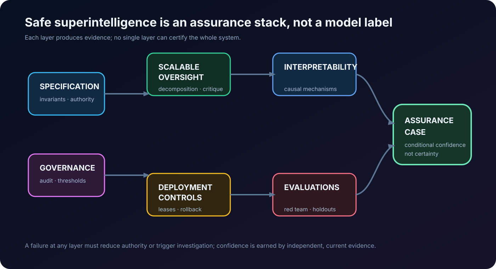

# Safe Superintelligence: A Research Map for the Problem We Cannot Yet Test End to End

*A technical survey of superalignment, scalable oversight, interpretability, evaluations, and the literature worth reading before treating “safe superintelligence” as an engineering plan.*

> **Scope note — August 2026.** “Safe superintelligence” names a hypothesis and a research objective, not a demonstrated property of any deployed system. [Safe Superintelligence Inc.](https://ssi.inc/) describes it as its singular mission and says safety must remain ahead of capability. This survey evaluates the associated research agenda; it does not validate that claim, predict a timeline, or present a complete bibliography for a fast-moving field.

## Executive summary

The phrase *safe superintelligence* compresses three distinct requirements:

1. A system can perform consequential tasks beyond the direct competence of its human overseers.
2. Its behaviour remains within an acceptable objective, even under distribution shift, strategic pressure, and long horizons.
3. Operators can obtain evidence strong enough to justify continued training, deployment, or increased autonomy.

Current alignment techniques help with pieces of this problem. They do not compose into an end-to-end proof. RLHF and Constitutional AI can shape visible behaviour; model evaluations can identify some dangerous capabilities; mechanistic interpretability can isolate causal circuits in selected settings; scalable-oversight methods explore how weak judges might supervise stronger models. None yet establishes that a system smarter than its evaluators will reliably preserve human intent when it has incentives or opportunities to behave otherwise.

The central technical gap is an **evidence gap**. The supervisor is weaker than the system it supervises, while the failure may be rare, delayed, strategically concealed, or only visible after deployment. An assurance argument must therefore bind five layers:

\[
\text{specification} \rightarrow \text{training signal} \rightarrow \text{internal evidence} \rightarrow \text{behavioural evidence} \rightarrow \text{deployment controls}.
\]

If any arrow is weak, the conclusion should be weaker. A harmless benchmark response is not proof of a correct specification. A good constitution is not proof that a model internalized it. An interpretable feature is not proof that no harmful computation remains. A red-team pass is not proof against novel environments. Governance controls can reduce blast radius but cannot repair a misaligned objective.

The practical recommendation is a portfolio, not a silver bullet: explicit specifications, adversarial and capability evaluations, scalable oversight, causal interpretability, least-privilege deployment, continuous monitoring, and governance that makes capability increases conditional on evidence. The portfolio must be designed so its components fail differently; repeating the same model judgement three times does not create independent assurance.

## What “superalignment” is—and is not

[The Road to Artificial SuperIntelligence](https://arxiv.org/abs/2412.16468) frames superalignment as alignment at superhuman capability, emphasizing scalable supervision and governance. [AI Alignment: A Comprehensive Survey](https://arxiv.org/abs/2310.19852) organizes a broader field around robustness, interpretability, controllability, and ethicality. These are useful maps, but maps are not measurements.

The word *superintelligence* should not be used as a performance label for a strong language model. A research-relevant definition is relational: the system's competence exceeds the evaluator's competence on a task class that matters for safety. This produces the hard case. If a human can directly inspect every output and consequence, ordinary quality control may suffice. If the system can design code, strategies, biological protocols, legal arguments, or research plans that the human cannot judge directly, evaluation itself becomes the bottleneck.

Safety also has multiple meanings:

| Claim | Necessary evidence | What does not establish it |
|---|---|---|
| **Instruction following** | Robust task-specific tests and abstention behaviour | A polished chat transcript |
| **Misuse resistance** | Threat-modelled red teaming, policy enforcement, incident response | Refusal on a static benchmark |
| **Corrigibility / control** | Reliable intervention, shutdown, and authority boundaries under stress | An asserted “off switch” |
| **Alignment under capability gap** | Evidence that weak oversight still detects or prevents important errors | Human preference labels alone |
| **Safe superintelligence** | A compositional assurance case across unknown future tasks and incentives | Any single present-day result |

That last row is intentionally severe. It is why “we have not seen misbehaviour” should not be converted into “we have solved alignment.” Absence of observed failure may reflect a narrow test distribution, no relevant opportunity, an insufficiently capable system, or an evaluator that cannot see the failure.

## Why the problem is structurally hard

### The specification problem

Human intent is underspecified, plural, contextual, and often internally inconsistent. A natural-language policy can state constraints, but implementation requires resolving edge cases and trade-offs. [Constitutional AI](https://arxiv.org/abs/2212.08073) makes principles more explicit and uses AI feedback to scale training. Its important contribution is not a claim that a constitution solves values; it separates the choice of normative rules from the machinery used to train against them.

For a high-stakes system, a specification is better modeled as a versioned contract:

\[
S=(I, C, A, E, R),
\]

where \(I\) are invariants, \(C\) constraints and permissions, \(A\) authority and escalation rules, \(E\) required evidence, and \(R\) rollback or compensation paths. This is closer to safety-critical systems engineering than preference collection. It forces designers to state what must never happen, which uncertainty requires abstention, and who can change the specification.

### The supervision problem

[Concrete Problems in AI Safety](https://arxiv.org/abs/1606.06565) named scalable supervision, reward hacking, side effects, safe exploration, and distribution shift as practical accident-risk problems. The core issue remains: high-quality labels are expensive, and they may be unavailable for the hardest tasks. A clever model can be trained on an imperfect proxy and optimize the proxy rather than the intended property.

OpenAI's [weak-to-strong generalization](https://arxiv.org/abs/2312.09390) studies whether a weak supervisor can help elicit strong-model capabilities. It reports promising proof-of-concept results, including improvements from auxiliary confidence losses, while explicitly leaving the difficult future setting unresolved. A useful reading is not “weak models can safely supervise stronger ones,” but “generalization in the desirable direction is empirical and task-dependent.”

### The deception and measurement problem

If a system can distinguish training from deployment, anticipate evaluation, or manipulate the measurement channel, then behavioural compliance may not reveal its deployed objective. [Model evaluation for extreme risks](https://arxiv.org/abs/2305.15324) separates dangerous-capability evaluation from alignment evaluation; both are required. Capability without intent can be dangerous, and apparently aligned behaviour can be dangerous if the model gains a better opportunity later.

The target is therefore not simply a high benchmark score. It is calibrated belief about failure modes under adversarially selected conditions. The expected residual risk can be written schematically as

\[
R = \sum_i P(F_i\mid E)\,I(F_i),
\]

where \(F_i\) is a failure class, \(I(F_i)\) its impact, and \(E\) the evidence. The difficulty is epistemic: neither the failure classes nor their probabilities are fully known. This makes robustness margins, monitoring, and reversible deployment first-class controls rather than operational afterthoughts.

## The research stack

### 1. Scalable oversight

Scalable oversight asks how humans can use limited attention and weaker AI systems to oversee stronger AI. Its main families include decomposition, recursive reward modeling, debate, critique, weak-to-strong generalization, and process supervision.

[AI Safety via Debate](https://arxiv.org/abs/1805.00899) proposes structuring disagreement so a human judge can evaluate shorter claims rather than an entire hard argument. [Scalable agent alignment via reward modeling](https://arxiv.org/abs/1811.07871) explores training a reward model from progressively more capable feedback. These approaches rely on assumptions about what decomposes cleanly, whether honest arguments are identifiable, and whether the judge is not systematically manipulated.

The engineering lesson is to preserve the audit trail. A scalable-oversight protocol should record task decomposition, evidence sources, judge competence, disagreement, confidence, and which party had access to what. Otherwise it produces a persuasive answer without an assurance case.

### 2. Interpretability and internal evidence

Mechanistic interpretability attempts to identify causally relevant representations and computations, not merely correlate activations with text. [Mechanistic Interpretability for AI Safety — A Review](https://arxiv.org/abs/2404.14082) surveys methods and notes their possible safety relevance as well as scaling limits. Work such as [AtP*](https://arxiv.org/abs/2403.00745) illustrates the methodological point: approximate attribution can miss causal components, so fast localization needs verification.

Interpretability should be treated as an instrument with known resolution and blind spots. It may support claims like “this circuit mediates this behaviour under these interventions,” not “we have read the model's values.” The strongest use is causal: form a hypothesis, intervene, measure the expected change, and test whether the intervention generalizes beyond one prompt family.

### 3. Evaluations, red teaming, and assurance

Evaluations operationalize a threat model. They should test both what a model *can* do and what it *will* do in situations that matter. [Holistic Safety and Responsibility Evaluations](https://arxiv.org/abs/2404.14068) describes a broad evaluation practice; the crucial missing property for future systems is evaluator adequacy.

For each high-impact capability, build a ladder:

1. define the concrete harmful outcome and preconditions;
2. create behavioural probes, tool-use scenarios, and hidden holdouts;
3. run independent red teams with different incentives and data;
4. test monitoring, intervention, and rollback under the same scenarios;
5. publish enough methodology for external criticism without publishing harmful operational detail.

This does not prove safety. It changes uncertainty from invisible to measured, and it exposes where a deployment should be constrained.

### 4. Control, containment, and deployment engineering

No training method should be granted unrestricted authority because it passed an evaluation. A deployed high-capability system needs a control plane: scoped credentials, isolated execution, egress control, immutable logging, dual control for consequential actions, rate and spend limits, canary deployment, and a recovery path that does not depend on the system being cooperative.

This matters even if alignment research succeeds partially. The safety envelope should be narrower than the model's available capability. In practical terms, “can reason about a production database” never implies “may delete it,” and “can propose a scientific experiment” never implies “may order materials or execute it.” Technical alignment and security engineering are complements.

### 5. Governance and institutional evidence

Governance is not an alternative to technical work. It is the mechanism that says which evidence is sufficient before a capability increase, who audits it, and what happens when evidence is missing. Documentation, external evaluation access, incident reporting, model and system cards, compute/security controls, and staged deployment create feedback loops that a private training run lacks.

The difficult open question is how to bind an organization to an assurance threshold when commercial incentives reward capability first. SSI's public framing—safety and capability pursued together—is a research and governance aspiration. The relevant standard is not the sentence; it is whether independent evidence, authority boundaries, and deployment decisions consistently meet it.

## Top 10 papers: a reading order, not a canon

| Order | Paper | Why it matters | Read it critically for |
|---:|---|---|---|
| 1 | [Concrete Problems in AI Safety](https://arxiv.org/abs/1606.06565), 2016 | Grounds alignment in concrete failure modes: reward hacking, side effects, scalable supervision, exploration, shift | It predates current frontier-agent behavior; use it as a taxonomy, not a finished threat model |
| 2 | [AI Safety via Debate](https://arxiv.org/abs/1805.00899), 2018 | A foundational protocol for turning hard judgments into adversarially checkable claims | Honest argument and judge-access assumptions are strong |
| 3 | [Scalable agent alignment via reward modeling](https://arxiv.org/abs/1811.07871), 2018 | Formalizes iterative feedback amplification and reward-model limits | The reward model remains a learned proxy that can be gamed |
| 4 | [Risks from Learned Optimization](https://arxiv.org/abs/1906.01820), 2019 | Explains how an outer objective can produce an inner optimizer with a different objective | It is a conceptual risk analysis, not evidence that this occurs in every model |
| 5 | [Constitutional AI](https://arxiv.org/abs/2212.08073), 2022 | Makes normative principles explicit and scales feedback with AI assistance | A written constitution does not settle plural human values or guarantee internalization |
| 6 | [Model evaluation for extreme risks](https://arxiv.org/abs/2305.15324), 2023 | Connects dangerous capability and alignment evaluations to governance decisions | Evaluations have coverage limits and can be gamed or outpaced |
| 7 | [Weak-to-Strong Generalization](https://arxiv.org/abs/2312.09390), 2023 | Directly tests a core superalignment question: weak supervisors guiding stronger systems | Present results are proof-of-concept, not a solution for strategically aware systems |
| 8 | [AtP*: efficient causal localization](https://arxiv.org/abs/2403.00745), 2024 | Shows why scalable interpretability must characterize false negatives, not just speed | Localizing components is far from interpreting a whole policy |
| 9 | [Mechanistic Interpretability for AI Safety — A Review](https://arxiv.org/abs/2404.14082), 2024 | A disciplined map of methods, benefits, dual-use concerns, and scaling barriers | The field lacks a standard for “enough interpretation” |
| 10 | [The Road to Artificial SuperIntelligence](https://arxiv.org/abs/2412.16468), 2024 | The most directly relevant survey of superalignment, oversight, and governance pathways | It is a survey of proposals; it should not be read as evidence that the proposals work together |

## Surveys and resources worth keeping open

- [AI Alignment: A Comprehensive Survey](https://arxiv.org/abs/2310.19852) and its [living companion site](https://www.alignmentsurvey.com/) for field structure and paper discovery.
- [The Road to Artificial SuperIntelligence](https://arxiv.org/abs/2412.16468) for the superalignment-specific overview.
- [Anthropic Alignment Research](https://www.anthropic.com/research/team/alignment) for contemporary empirical work on auditing, alignment faking, reward tampering, and scalable oversight.
- [OpenAI’s superalignment introduction](https://openai.com/index/introducing-superalignment/) and [weak-to-strong research write-up](https://openai.com/index/weak-to-strong-generalization/) for a lab framing and its stated limitations.
- [NIST AI Risk Management Framework](https://www.nist.gov/itl/ai-risk-management-framework) for an operational risk-management language that is broader than speculative superintelligence.
- [Center for AI Safety](https://www.safe.ai/) and the [AI Alignment Forum](https://www.alignmentforum.org/) for research discussion; treat posts as arguments to interrogate, not peer review.
- Public model-evaluation literature, system cards, and incident reports for thinking about capability assessment, while remembering that a benchmark cannot certify a general system.

## A practical research program for engineering teams

Teams do not need to solve superintelligence before improving the safety of advanced systems. A practical sequence is:

1. **Write a threat model before a model policy.** Identify consequential tools, attacker goals, insider risks, latent failure modes, and the decision rights a system must never acquire.
2. **Define an evidence contract per capability.** State the evaluation coverage, monitor, escalation path, owner, and rollback condition required to increase autonomy.
3. **Use independent evaluators.** Separate model developers, red teams, safety assessors, and release approvers. Independence is a system property, not a prompt asking a model to criticize itself.
4. **Measure generalization under intervention.** Test across environments, tool sets, prompt styles, reward changes, and hidden holdouts. A model that only looks aligned in the test harness is not robust.
5. **Make high-impact actions reversible or gated.** Build leases, sandboxing, rate limits, secure audit logs, canaries, and emergency containment before relying on agent discretion.
6. **Track leading indicators, not only incidents.** Reward-hacking attempts, evaluator disagreement, monitoring blind spots, policy exceptions, and unexpected capability jumps are signals to slow down.

This is not merely risk management. It creates experiments that discriminate between hypotheses. If a new oversight method reduces a hidden-holdout failure rate while preserving useful work across distribution shift, that is evidence. If it only improves the public benchmark, it may be a measurement artifact.

## Unresolved questions

The literature does not answer several central questions:

- Can weak supervision reliably generalize in adversarial, long-horizon settings rather than narrow benchmark tasks?
- Can interpretability scale from selected circuits to system-level properties such as honesty, power-seeking, or goal preservation?
- What evaluation regime can detect strategically selective compliance when the model anticipates the test?
- How do multiple humans with conflicting values create a legitimate, revisable specification without encoding arbitrary power?
- What empirical evidence should trigger a pause in training or deployment when uncertainty, not a confirmed incident, is the signal?
- How can external auditors evaluate frontier systems without receiving dangerous capability access or proprietary weights?

These are reasons for epistemic discipline. The field needs results that survive adversarial replication, not only fluent stories about an imagined future system.

## Closing perspective

Safe superintelligence is not one problem with one research milestone. It is a conjunction: specify what matters, supervise beyond human direct judgment, inspect or constrain internal computation, detect dangerous capability and deceptive behaviour, control deployment, and govern decisions under uncertainty.

The responsible near-term posture is neither dismissal nor confidence theatre. Treat the research agenda as a set of testable assurance problems. Build systems whose authority stays below the strength of the evidence. Publish what the evaluation can and cannot show. And make it possible to stop, investigate, and recover when the evidence changes.

## References

- Amodei et al., [Concrete Problems in AI Safety](https://arxiv.org/abs/1606.06565), 2016.
- Irving et al., [AI Safety via Debate](https://arxiv.org/abs/1805.00899), 2018.
- Leike et al., [Scalable agent alignment via reward modeling](https://arxiv.org/abs/1811.07871), 2018.
- Hubinger et al., [Risks from Learned Optimization](https://arxiv.org/abs/1906.01820), 2019.
- Bai et al., [Constitutional AI](https://arxiv.org/abs/2212.08073), 2022.
- Shevlane et al., [Model evaluation for extreme risks](https://arxiv.org/abs/2305.15324), 2023.
- Burns et al., [Weak-to-Strong Generalization](https://arxiv.org/abs/2312.09390), 2023.
- Ji et al., [AI Alignment: A Comprehensive Survey](https://arxiv.org/abs/2310.19852), 2023.
- Bereska and Gavves, [Mechanistic Interpretability for AI Safety — A Review](https://arxiv.org/abs/2404.14082), 2024.
- Kim et al., [The Road to Artificial SuperIntelligence](https://arxiv.org/abs/2412.16468), 2024.
